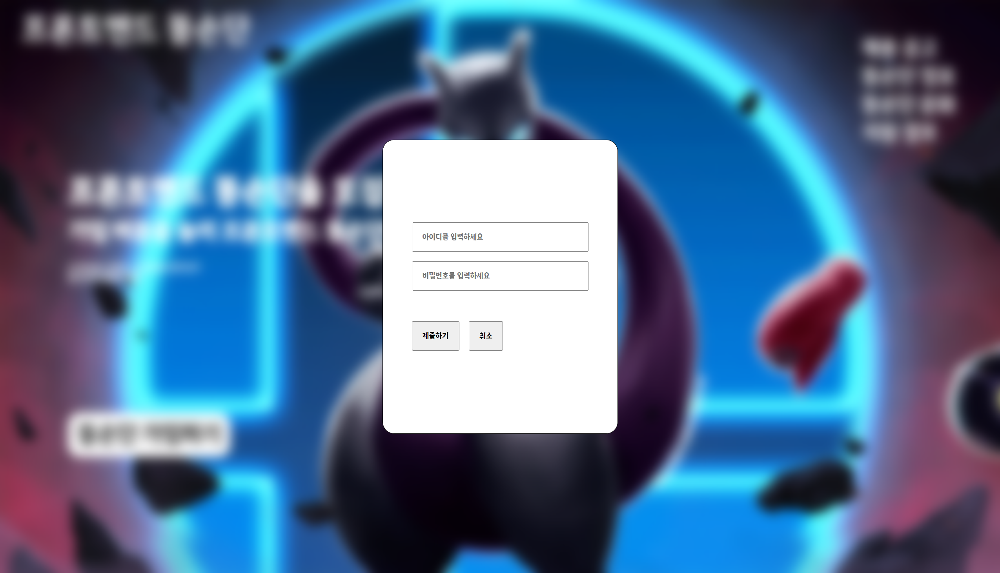
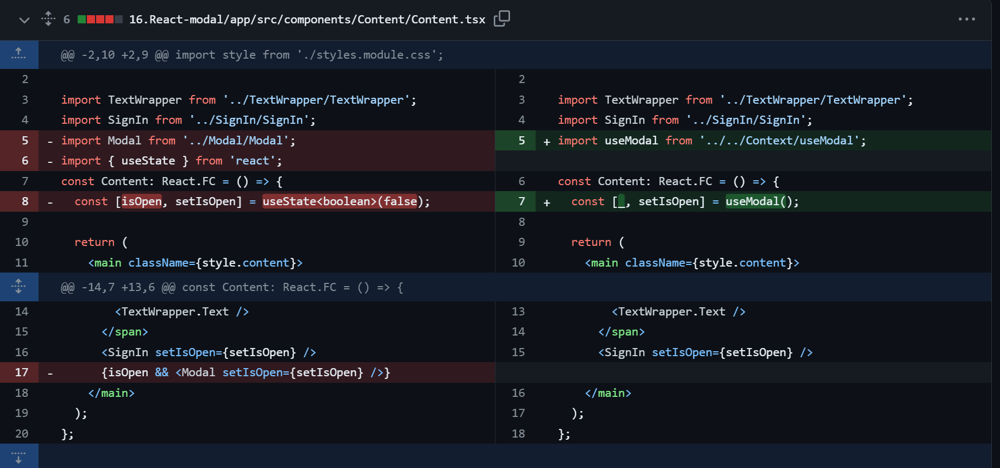

# 기존 `Modal` 기능 수정하기

---

이전 게시글에서 `Modal` 을 다음과 같이 구현해줬었다.

#### `App`

```jsx
function App() {
  return (
    <Wrapper>
      <Header />
      <Content /> // Modal 을 여닫는 트리거 , 모달 렌더링 위치
    </Wrapper>
  );
}
```

#### `Content`

```tsx
const Content: React.FC = () => {
  const [isOpen, setIsOpen] = useState < boolean > false; // 모달 제어하기 위한 state

  return (
    <main className={style.content}>
      <span>
        <TextWrapper.Title />
        <TextWrapper.Text />
      </span>
      <SignIn setIsOpen={setIsOpen} /> // 해당 버튼이 눌리면 isOpen = true
      {isOpen && <Modal setIsOpen={setIsOpen} />}
      // isOpen true 일 때 Modal 컴포넌트 렌더링
    </main>
  );
};
```

#### `Modal`

```tsx
const Modal: React.FC<Props> = ({ setIsOpen }) => {
  const formRef = useRef<HTMLFormElement>(null);

  const handleSubmit = (e: React.MouseEvent<HTMLButtonElement>) => {
    e.preventDefault();
    // Submit 을 하는 어떤 로직들 ..
    setIsOpen(false);
  };

  const handleCancle = (e: React.MouseEvent<HTMLButtonElement>) => {
    e.preventDefault();
    setIsOpen(false);
  };

  const handleClickWrapper = (e: React.MouseEvent<HTMLOptionElement>) => {
    // 1. formRef.current 가 null 이 아니고 (mount 이후)
    // 2. 눌린 e.target 이 formRef.current 내부 엘리먼트가 면
    if (formRef.current && !formRef.current.contains(e.target as Node)) {
      setIsOpen(false);
    }
  };

  return (
    // 전체 화면을 흐리게 만들기 위한 wrapper
    <section className={style.modalWrapper} onClick={handleClickWrapper}>
      // 이후 부분이 모달
      <form action='/' ref={formRef}>
        <div className={style.group}>
          <input
            type='text'
            id='username'
            name='username'
            placeholder='아이디를 입력하세요'
          />
        </div>
        <div className={style.group}>
          <input
            type='text'
            id='password'
            name='password'
            placeholder='비밀번호를 입력하세요'
          />
        </div>
        <div className={style.buttonWrapper}>
          <button className={style.submit} onClick={handleSubmit}>
            제출하기
          </button>
          <button className={style.submit} onClick={handleCancle}>
            취소
          </button>
        </div>
      </form>
    </section>
  );
};
```


다음과 같은 컴포넌트들의 조합을 통해 모달 컴포넌트를 구현해줬었다.

이렇게 하여도 기능 구현에는 전혀 문제가 없으나 몇 가지 불편한 점이 존재한다.

# 기존 `Modal` 의 문제점 찾기

---

### `Modal` 컴포넌트의 올바르지 않은 의미론적 구조

---

```tsx
const Modal: React.FC<Props> = ({ setIsOpen }) => {
  /**
   * 생략 ..
   **/

  return (
    // ModalWrapper
    <section className={style.modalWrapper} onClick={handleClickWrapper}>
      // 실제 Modal ..
      <form action='/' ref={formRef}></form>
    </section>
  );
};
```



모달 컴포넌트가 반환하는 컴포넌트를 살펴보면 실제 모달에 해당하는 `form` 태그 외에

`form` 태그를 감싸고 있는 `section` 태그가 가장 상단에 존재한다.

이는 모달 역할을 하는 `form` 컴포넌트가 렌더링 될 때 주변 `UI` 를 흐리게 만들기 위해

뷰포트 전체를 덮는 컴포넌트가 필요했기 때문이다.

의미론적으로 이름을 좀 붙여보자면

`form` 태그 부분이 실제 `Modal` 에 해당 할 것이고

`Modal` 을 덮는 부모 태그인 `section` 태그는 모달을 감싸는 `ModalWrapper` 의 의미를 가지고 있다.

그렇다면 , **`Modal` 컴포넌트에서 `ModalWrapper` 까지 함께 렌더링 하는 것은 의미론적으로 맞지 않는다.**

또한, 현재는 모달이 1개만 존재하지만

모달이 여러개 존재 할 때 동일한 `ModalWrapper` 를 항상 생성해주기 위해

**동일한 스타일을 갖는 `section` 태그를 서로 다른 모달을 생성 할 때 마다 매번 작성해야하는 비효율적인 과정이 추가된다.**

### `Modal` 이 존재하는 `Content` 의 올바르지 않은 의미론적 구조

---

```tsx
const Content: React.FC = () => {
  const [isOpen, setIsOpen] = useState<boolean>(false);

  return (
    <main className={style.content}>
      <span>
        <TextWrapper.Title />
        <TextWrapper.Text />
      </span>
      <SignIn setIsOpen={setIsOpen} />
      // Modal 컴포넌트는 Content 컴포넌트 내부에서 렌더링 되는게 맞을까?
      {isOpen && <Modal setIsOpen={setIsOpen} />}
    </main>
  );
};
```

모달의 렌더링 유무를 트리거 하는 `SignIn` 컴포넌트가 존재하는 `Content` 컴포넌트 내부에서

`Modal` 컴포넌트는 `SignIn` 에 의해 변경되는 상태값들인 `isOpen , setIsOpen` 에 영향을 받는다.

이로 인해 `Modal` 컴포넌트는 `Content` 컴포넌트 내부에서만 호출되어야 하는 강한 종속성을 갖게 되었다.

현재 우리는 `Modal` 컴포넌트를 전역적인 위치에서 띄우고 싶고 , `Modal` 컴포넌트가 렌더링 될 때엔

`body` 태그 이하에 존재하는 모든 컴포넌트의 기능을 `block` 하고 싶다.


> 빨간 영역은 `Content` 컴포넌트의 범위

하지만 현재의 구조에서는 `Content` 컴포넌트와의 종속성으로 인해

우리 `Modal` 의 의미론적 구조에 맞지 않게 `Content` 컴포넌트 내부에서 호출되고 있다.

이러한 문제로 인해 전체 뷰포트를 덮는 `ModalWrapper` 라는 인위적인 태그를 `Modal` 컴포넌트 내부에서 생성해주었다.

```tsx
const Modal: React.FC<Props> = ({ setIsOpen }) => {
  ...
  return (
    <section className={style.modalWrapper} onClick={handleClickWrapper}>
      <form action='/' ref={formRef}></form>
    </section>
  );
};
```

> `ModalWrapper` 는 `width : 100vw , height : 100vh , position : fixed , top : 0px , left : 0px` 의 스타일 속성을 가지고 있다.
> 즉 `ModalWrapper` 는 뷰포트를 모두 덮는 `HTMLElementTag` 이다.
> `ModalWrapper` 덕에 `Modal` 역할을 하는 `form` 태그가 어느 컴포넌트 내부에서 호출되더라도 뷰포트 기준으로 렌더링 되게 해주었다.

이렇게 `Content` 컴포넌트 내부에서 뷰포트를 모두 덮는 (`Content` 컴포넌트 범위를 넘어가는) 인위적이고 어색한 구조는

`Content` 컴포넌트의 의미론적 구조 뿐 아니라 `Modal` 컴포넌트의 의미론적 구조 마저 이상하게 만든다.

```tsx
const Content: React.FC = () => {
  const [isOpen, setIsOpen] = useState<boolean>(false);

  return (
    <main className={style.content}>
      <span>
        <TextWrapper.Title />
        <TextWrapper.Text />
      </span>
      // 모달의 렌더링을 trigger 하는 컴포넌트
      <SignIn setIsOpen={setIsOpen} />
      // trigger 는 Content 에서 되지만 실제 Modal 은 뷰포트를 기준으로 렌더링 됨
      {isOpen && <Modal setIsOpen={setIsOpen} />}
    </main>
  );
};
```

이런 어색한 구조로 인해 `Content` 컴포넌트 내부에 존재하는 `Modal` 이

`Content` 컴포넌트 내부에서만 렌더링 되는 모달인지, 뷰포트를 덮는 모달인지 파악 할 수 없게 되었다.

# 기존 `Modal` 의 문제점 해결하기

---

그럼 현재의 문제점을 제대로 정의하고 문제점을 해결해나가보자

현재의 가장 큰 문제점은 `Modal` 이 `global` 적으로 렌더링 되어야 하는데

`Content` 내부에 선언된 `isOpen state` 값에 종속되어 있어 `Content` 컴포넌트 내부에서만 호출되어야 한다는 점이다.

### `Modal` 렌더링에 관여하는 `state` 전역적으로 선언하기

---

이를 해결하기 위해 `Modal` 컴포넌트 렌더링에 관여하는 `state` 를 전역적으로 관리해주도록 하자

#### `ModalContext`

```tsx
import { createContext, Dispatch, SetStateAction } from 'react';

type ModalContextType = [boolean, Dispatch<SetStateAction<boolean>>];

const ModalContext = createContext<ModalContextType>([false, () => {}]);

export default ModalContext;
```

다음과 같이 `Modal` 의 상태를 저장할 `Context` 인 `ModalContext` 를 생성해준다.

이후 `ModalContext` 를 이용한 컴포넌트인 `ModalProvider` 와 `useModal` 커스텀 훅을 생성해주도록 하자

#### `ModalProvider`

```tsx
import ModalContext from './Context';

type Props = {
  children: ReactNode;
};

const ModalProvider: React.FC<Props> = ({ children }) => {
  const [isOpen, setIsOpen] = useState<boolean>(false); // 전역적으로 관리될 state 생성
  return (
    <ModalContext.Provider value={[isOpen, setIsOpen]}>
      {children}
    </ModalContext.Provider>
  );
};
```

#### `useModal`

```tsx
import { useContext, Dispatch, SetStateAction } from 'react';

import ModalContext from './Context';

type ModalContextType = [boolean, Dispatch<SetStateAction<boolean>>];

const useModal = (): ModalContextType => {
  const [open, setIsOpen] = useContext(ModalContext);
  return [open, setIsOpen];
};

export default useModal;
```

이제 `Context` 가 전달하는 `value` 값들을 받기 위한 커스텀 훅을 생성해주자

`useModal` 은 `ModalContext` 가 전달하는 `value` 값들을 반환하는 `useContext` 를 캡슐화 한 훅이다.

```tsx
function App() {
  return (
    <ModalProvider>
      // 이제 [isOpen , setIsOpen] 은 전역적으로 사용 가능하게 되었다. //
      useModal 훅을 이용해 모달을 렌더링 하기 위한 상태 값을 변경 할 수 있다.
      <Wrapper>
        <Header />
        <Content />
      </Wrapper>
    </ModalProvider>
  );
}
```

### 전역적으로 관리되는 `Modal` 을 렌더링 할 영역 생성하기

#### `GlobalModalWrapper`

```tsx
import useModal from '../../Context/useModal';

import Modal from '../Modal/Modal';

import style from './style.module.css';

const visibleStyle = {
  display: 'flex',
  justifyContent: 'center',
  alignItems: 'center',
};

const inVisibleStyle = {
  display: 'none',
};

const GlobalModalWrapper: React.FC = () => {
  const [isOpen, setIsOpen] = useModal();
  const handleClickWrapper = (e: React.MouseEvent<HTMLOptionElement>) => {
    setIsOpen(false);
  };

  return (
    <section
      className={style.global}
      style={isOpen ? { ...visibleStyle } : { ...inVisibleStyle }}
      onClick={handleClickWrapper}
    >
      {isOpen && <Modal />}
    </section>
  );
};

export default GlobalModalWrapper;
```

```css
.global {
  position: absolute;
  z-index: 999;
  top: 0px;
  left: 0px;

  width: 100vw;
  height: 100vh;

  background-color: inherit;
  backdrop-filter: blur(20px);
}
```

다음과 같이 전역에서 모달을 띄울 `GlobalModalWrapper` 컴포넌트를 생성해준다.

`GlobalModalWrapper` 내부에는 전역적으로 생성될 `Modal` 들을 감싸고 있는 랩퍼 컴포넌트이다.

해당 랩퍼 컴포넌트는 `isOpen` 이 `true` 일 때만 렌더링 노드에 추가 되는 컴포넌트이며

모달의 상태에 관여하는 `isOpen` 값이 `true` 일 때에만 렌더링 된다.

#### `App.tsx`

```tsx
import './App.css';
import ModalProvider from './Context/Provider';
import Wrapper from './components/Wrapper/Wrapper';
import Header from './components/Header/Header';
import Content from './components/Content/Content';
import GlobalModalWrapper from './components/GlobalModalWrapper/GlobalModalWrapper';
function App() {
  return (
    <ModalProvider>
      <Wrapper>
        <Header />
        <Content /> // 모달을 트리거 하는 영역
        <GlobalModalWrapper /> // 모달을 렌더링 하는 영역
      </Wrapper>
    </ModalProvider>
  );
}
역역;
export default App;
```

이후 다음과 같이 엔트리 파일에 `GlobalModalWrapper` 컴포넌트를 추가해줌으로서

모달 렌더링을 트리거 하는 영역과 모달을 렌더링 하는 영역을 분리해준다.

### 기존 `Modal` 컴포넌트 수정하기

```tsx
import style from './styles.module.css';
import useModal from '../../Context/useModal';

const Modal: React.FC = () => {
  // const formRef = useRef<HTMLFormElement>(null); 불필요함으로 제거
  const [_, setIsOpen] = useModal();
  /**
   * 생략
   **/

  const stopPropoation = (e: React.MouseEvent<HTMLFormElement>) => {
    e.stopPropagation();
  };

  return (
    <form action='/' ref={formRef} onClick={stopPropoation}>
      // ... 생략
    </form>
  );
};

export default Modal;
```

이후 기존 `Modal` 컴포넌트에서 인위적으로 생성해두었던 `section` 태그를 제거해주고

모달 자체에 `e.stopPropagation` 을 추가해줌으로서

`GlobalModalWrapper` 내에서의 클릭 이벤트 (`isOpen` 을 `false` 로 변경하는 ) 가 모달에 전파되지 않도록 수정해준다.

# 수정된 부분 평가

---

이렇게 수정함으로서 이전과 무엇이 달라졌을까 ?

### `Content` 컴포넌트 수정사항



이전과 다르게 `Content` 컴포넌트에서 `Modal` 컴포넌트가 제거되어

`Content` 컴포넌트의 역할이 명확히 된 모습을 볼 수 있다.

이전 `Content` 의 영역은 `Modal` 이 렌더링 되게 `trigger` 시킬 뿐 아니라

`Modal` 컴포넌트를 렌더링 하는 역할을 하고 있었다.

> 심지어 `Content` 컴포넌트 이외의 영역에 `Modal` 을 렌더링 시키기 위해 뷰포트만한 `ModalWrapper` 로 감싸져있는 `Modal` 을 렌더링 하는 어색한 구조의 `Modal` 컴포넌트를 말이다.

하지만 수정된 이후의 `Conten의` 컴포넌트는 `Modal` 컴포넌트를 `trigger` 하는 컴포넌트를 담은

본인만의 역할에 집중 할 수 있도록 수정되었다.

### `Modal` 컴포넌트 수정사항

`Modal` 컴포넌트에선 어떤 부모 컴포넌트 내부에서 렌더링 되지 않고 뷰포트 내에서 생성되게 하기 위해 만들었던

`section className= {style.modalWrapper}` 태그가 사라졌다.

더이상 `Modal` 컴포넌트는 더이상 본인을 `trigger` 시키는 컴포넌트 내에서 렌더링 되는 것이 아니라

뷰포트 크기의 랩퍼 컴포넌트 내부에서만 렌더링 되기 때문이다.

### 확장성은 어떤데 ?

만약 전역적으로 렌더링 되어야 하는 모달이 더 추가되었다고 가정해보자

```tsx
const GlobalModalWrapper: React.FC = () => {
  const [isOpen, setIsOpen] = useModal();
  const [isOpen2, setIsOpen2] = useModal2(); // 두 번째 모달이 생성되었다고 가정
  const handleClickWrapper = (e: React.MouseEvent<HTMLOptionElement>) => {
    setIsOpen(false);
    setIsOpen2(false);
  };

  // 모달이 하나라도 열린게 있는지 확인하는 boolean
  const isModalsOpen = [isOpen, isOpen2].reduce((pre, cur) => pre + cur);

  return (
    <section
      className={style.global}
      style={isModalsOpen ? { ...visibleStyle } : { ...inVisibleStyle }}
      onClick={handleClickWrapper}
    >
      {isOpen && <Modal />}
      {isOpen2 && <Modal2 />} // 추가된 Modal 렌더링
    </section>
  );
};
```

그럴 경우엔 다음과 같이 단순하게 `GlobalModalWrapper` 내부에서 모달을 추가해주기만 하면 된다.

이렇게 전역적으로 생성되는 `Modal` 들을 `GlobalModalWrapper` 내부에서 중앙 집권화 하여 관리해줌으로서

전역적으로 생성되는 `Modal` 을 관리해주는 것도 더 간편해졌다.
