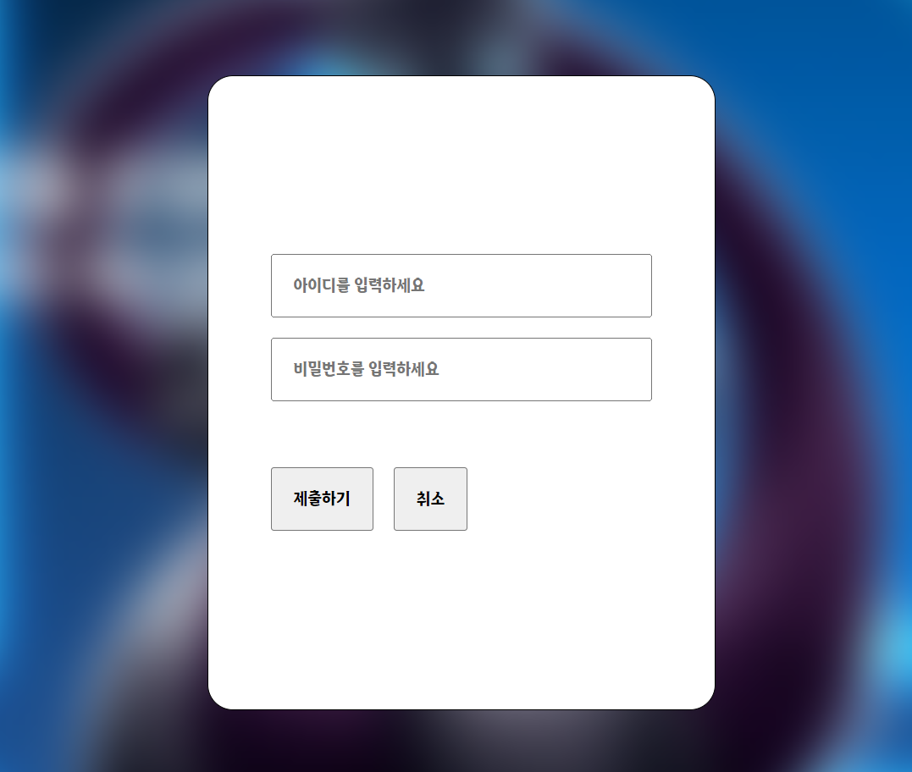
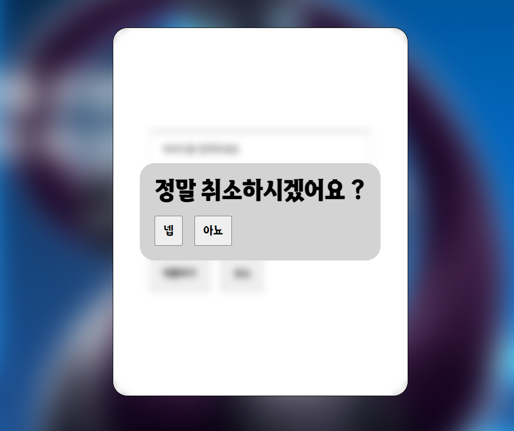

방금 전 모달에 대해 공부하고

아 ~ 드디어 다 공부헀다 ~ 이랬었는데

우연히 프론트엔드 클린코드에 대한 유튜브 게시글을 보았다.

> https://www.youtube.com/watch?v=edWbHp_k_9Y

운이 좋게도 해당 글은 모달과 관련된 클린 코드에 대한 이야기였는데

해당 내용을 보고 나니 내가 방금전에 짠 코드가 얼마나 악취가 나는 코드인지 알 수 있었다.

# 이전 모달의 기능의 문제점 찾고 리팩토링 하기

---

## 이전의 `Modal` 로직 `Recap`

#### 엔트리 컴포넌트인 `App`

```tsx
function App() {
  return (
    <ModalProvider>
      <Wrapper>
        <Header />
        {/*Modal 을 Trigger 하는 컴포넌트가 존재하는 컴포넌트  */}
        <Content />
        {/*전역에서 띄워질 Modal 이 들어갈 모달 랩퍼 컴포넌트  */}
        <GlobalModalWrapper />
      </Wrapper>
    </ModalProvider>
  );
}
```

나는 모달을 관리하는 `state` 들을 `Context` 를 이용한 전역에 정의해두고

모달을 `Trigger` 하는 컴포넌트와 모달이 렌더링 되는 부분을 분리해주었다.

#### 모달이 렌더링 되도록 트리거 하는 `Content`

```tsx
const Content: React.FC = () => {
  const [_, setIsOpen] = useModal(); // 전역 상태인 모달1에 대한 상태 값

  return (
    <main className={style.content}>
      <span>
        <TextWrapper.Title />
        <TextWrapper.Text />
      </span>
      <SignIn setIsOpen={setIsOpen} /> {/* 해당 버튼을 누르면 전역 상태가 변경됨 */}
    </main>
  );
};
```

이후 트리거가 존재하는 컴포넌트에선 단순히 전역 상태를 변경하는 `setter function` 을 `props` 로 넘겨주고

#### 전역 모달이 렌더링 되는 랩퍼 컴포넌트인 `GlobalModalWrapper`

```tsx
const visibleStyle = {
  display: 'flex',
  justifyContent: 'center',
  alignItems: 'center',
};

const inVisibleStyle = {
  display: 'none',
};

const GlobalModalWrapper: React.FC = () => {
  const [isOpen, setIsOpen] = useModal();
  const handleClickWrapper = (e: React.MouseEvent<HTMLOptionElement>) => {
    setIsOpen(false);
  };

  return (
    <section
      className={style.global}
      style={isOpen ? { ...visibleStyle } : { ...inVisibleStyle }}
      onClick={handleClickWrapper}
    >
      {/* 렌더링 될 모달을 해당 컴포넌트 내부에서 호출 */}
      {isOpen && <SignUpModal />}
    </section>
  );
};

export default GlobalModalWrapper;
```

모달이 렌더링 되는 영역에선 `Modal` 을 전역 상태에 따라 렌더링 시킬지 말지를

**미리 선언해두었다.**

## 문제점 정의하기

---

### 트리거 컴포넌트인 `Signup` 을 보고 역할을 명확히 판단 할 수 있는가 ?

나는 모달을 관리하기 위한 상태 값을 `useModal` 이라는 커스텀훅을 이용해 추상화 시켜주고

```tsx
// Content 컴포넌트의 반환값 일부
      <SignIn setIsOpen={setIsOpen} /> {/* 해당 버튼을 누르면 전역 상태가 변경됨 */}
```

`SignIn` 이라는 컴포넌트에 전역 상태를 변경시키는 `setter function` 을 넘겨줌으로서

`SignIn` 컴포넌트가 모달 렌더링과 관련된 전역 상태를 변경시키도록 하였다.

문제는 해당 컴포넌트의 `props` 만을 보고서 `SignIn` 컴포넌트가 모달을 트리거 하는 컴포넌트인지 ,

또 `SignIn` 컴포넌트가 눌렸을 때 렌더링 되는 모달은 어떤 컴포넌트인지 파악 할 수 없다는 점이다.

이는 렌더링 하기 위한 모달이 1~2개 정도밖에 되지 않을 때는 뇌의 용량이 아직 넉넉하여 흐름을 따라 갈 수 있지만

모달이 늘어나거나, 협업을 하는 단계에서는 욕을 바가지로 얻어먹기 좋은 컴포넌트 구성이다.

### `어쩌구ModalWrappe` 컴포넌트가 꼭 필요할까 ?

```tsx
function App() {
  return (
    <ModalProvider>
      <Wrapper>
        <Header />
        <Content />
        <GlobalModalWrapper />
        {/* 전역의 모달을 담기위한 Modalrapper 컴포넌트 
        해당 컴포넌트안에 렌더링 될 모달들이 이미 모두 정의되어 있다.*/}
      </Wrapper>
    </ModalProvider>
  );
}
```

나는 모달들을 담을 `ModalWrapper` 컴포넌트를 선언해두고 해당 컴포넌트 내부에

렌더링 되어야 할 모달들을 모두 조건부 렌더링으로 정의해두었다.

다만 시간 지나 생각해보니 이는 문제를 가지고 있다.

**만약 모달이 렌더링 되어야 할 위치들이 2개,3개,4개, ... N개 까지 늘어난다면 ?**

만약 모달이 렌더링 되어야 할 위치가 2개 이상이 된다면 여러 컴포넌트 사이 사이에 `어쩌구ModalWrappe` 들을 모두 선언해두어야 한다.

여러곳에 흩뿌려져있는 `어쩌구ModalWrapper` 들을 관리하는 것은 쉽지 않을 뿐더러

만약 모달들이 위치하고 있는 곳을 변경한다면 `이전ModalWrapper` 에서 변경할 컴포넌트를 제거하고

`이후ModalWrapper` 에 컴포넌트를 추가해줘야 한다.

이 과정 속에서 만약 휴먼에러가 발생한다면 예기치 못한 곳에서 동일한 모달이 두 번 나타나거나, 아예 나타나지 않는 등 예기치 못한 버그가 발생 할 수 있다.

### 문제점 요약하기

- 모달을 렌더링 시키는 트리거 컴포넌트의 역할을 컴포넌트의 생김새만을 보고 파악 할 수 없다.
- 모달들이 렌더링 될 영역을 렌더링 전 미리 선언해두는 것은 관리해야 할 컴포넌트들이 늘어날 뿐더러 관리하기 힘들다.

## 문제점 경험하기

실제로 만약 해당 로직을 사용하는채로 모달을 하나 더 추가하겠다고 가정해보자



첫 번째 모달이 생성된 상태에서 모달의 취소버튼을 누르면 취소하겠냐는 모달이 한 번 더 뜨도록 말이다.

취소버튼 모달이 뜨면 실행되기를 원하는 로직은 다음과 같다.

1. 취소하겠냐는 물음과 함께 확인 및 취소 버튼이 존재한다.
   1.1 확인 버튼이 눌리면 회원가입 모달창을 닫는다.
   1.2 취소 버튼이 눌리면 취소되지 않고 회원가입 모달창으로 돌아간다.
2. 취소 버튼의 모달창 또한 취소 버튼 모달창을 제외한 부분이 눌리면 취소 버튼 모달창이 취소된다.

### 취소 모달을 띄우기 위한 전역 상태 추가하기

```tsx
import { createContext, Dispatch, SetStateAction } from 'react';

type ModalContextType = [boolean, Dispatch<SetStateAction<boolean>>];

const ModalContext = createContext<ModalContextType>([false, () => {}]);
const CancleContext = createContext<ModalContextType>([false, () => {}]);

export { ModalContext, CancleContext };
```

```tsx
import { ReactNode, useState } from 'react';

import { ModalContext, CancleContext } from './Context';

type Props = {
  children: ReactNode;
};

const ModalProvider: React.FC<Props> = ({ children }) => {
  const [isOpen, setIsOpen] = useState<boolean>(false);
  const [isCancle, setIsCancle] = useState<boolean>(false);

  return (
    <ModalContext.Provider value={[isOpen, setIsOpen]}>
      <CancleContext.Provider value={[isCancle, setIsCancle]}>
        {children}
      </CancleContext.Provider>
    </ModalContext.Provider>
  );
};

export default ModalProvider;
```

```tsx
import { useContext, Dispatch, SetStateAction } from 'react';

import { CancleContext } from './Context';

type ModalContextType = [boolean, Dispatch<SetStateAction<boolean>>];

const useCancleModal = (): ModalContextType => {
  const [isCancle, setIsCancle] = useContext(CancleContext);
  return [isCancle, setIsCancle];
};

export default useCancleModal;
```

이전에 했던 것 처럼 `CancleModal` 을 관리할 상태를 `Context` 에 생성해주고

해당 상태값을 `useCancleModal` 훅을 이용해 전달 받아 사용 할 수 있도록 전역 상태를 추가해준다.

### `CancleModalWrapper` 생성하기

```tsx
const CancleModal = () => {
  const [isOpen, setIsOpen] = useModal();
  const [isCancle, setIsCancle] = useCancleModal();
  return (
    <section className={style.cancleModal} onClick={(e) => e.stopPropagation()}>
      <h1>정말 취소하시겠어요 ?</h1>
      <section>
        <button
          className={style.button}
          onClick={(e) => {
            e.stopPropagation();
            setIsCancle(false);
            setIsOpen(false);
          }}
        >
          넵
        </button>
        <button
          className={style.button}
          onClick={(e) => {
            e.stopPropagation();
            setIsCancle(false);
          }}
        >
          아뇨
        </button>
      </section>
    </section>
  );
};

export default CancleModal;
```

내부에서 띄워지는 `CancleModal` 컴포넌트를 다음처럼 구성해준다.

### `SignupModalWrapper` 생성하기

```tsx
  ...
const SignupModalWrapper: React.FC = () => {
  const [isCancle, setIsCancle] = useCancleModal();
  const handleCancle = () => {
    setIsCancle(false);
  };

  return (
    <section
      className={style.wrapper}
      style={isCancle ? { ...visibleStyle } : { ...inVisibleStyle }}
      onClick={handleCancle}
    >
      {isCancle && <CancleModal />}
    </section>
  );
};

export default SignupModalWrapper;
```

```tsx
const SignUpModal: React.FC = () => {
  ...
  return (
    <form action='/' onClick={stopPropoation}>
      <SignupModalWrapper />
      ...
    </form>
  );
};

export default SignUpModal;
```

이전 `GlobalModalWrapper` 를 생성해줬던 것 처럼 `SignupModalWrapper` 를 생성해준다.

해당 랩퍼 컴포넌트는 `SignupModal` 내부에서 렌더링 될 것이기 때문에 내부에 해당 컴포넌트를 미리 선언해둔다.



이후 취소버튼을 누르면 해당 모달창이 뜨며 해당 모달창을 통해

`SignUpModal` 을 포함하여 모두 제거해버릴 수도 , `CancleModal` 만 제거 할 수도 있게 되었다.

## 예시를 만들며 생각한 문제점 파악하기

### 기능 작동상의 오류

코드의 효율이 어떻니 마니를 생각하기 이전 , 기능상에 문제가 있음을 알 수 있다.


다음처럼 `SignUpModal` 이 생성되고 그 위에 `CancleModal` 이 렌더링 되었을 때

`SignUpModal` 외부 영역을 클릭하게 되면 `GlobalModalWrapper` 의 이벤트 핸들러로 인해

`SignUpModal` 렌더링에 관여하는 `isOpen` 이 `false` 로 변경되어 `Virtual DOM` 에서 `SignUpModal` 이 `unmount` 되게 된다.

문제는 `Unmount` 되는 시점에서 `isCancle` 의 `state` 가 변경되지 않은 상태로 `unmount` 되기 때문에

다시 마운트 될 때에는 `isCancle` 이 열린 상태로 모달이 열리게 된다.
