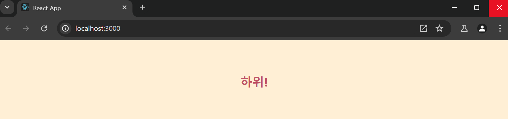
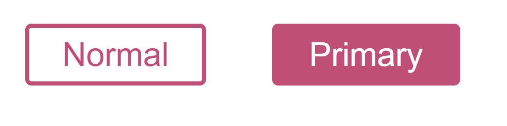
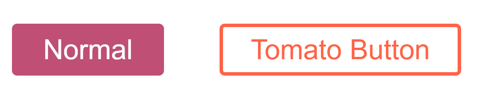
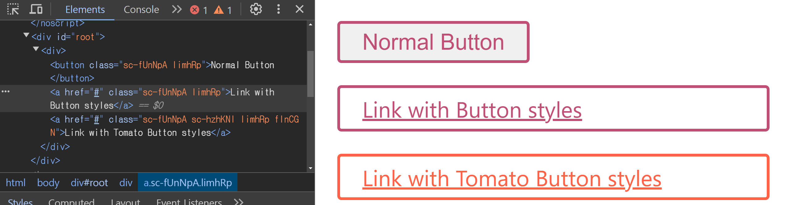
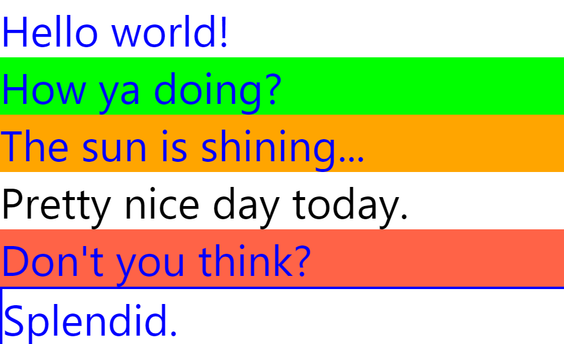

# `styled-component` 를 왜 배워야 할까 ?

---

여태까지는 `CSS in CSS` 방식으로 거대한 하나의 프로젝트를

하나의 `CSS` 파일 내에서 관리하는 방식으로 진행했다.

그러다가 각 `CSS name space` 들이 겹치는 문제가 발생하여

> 클래스명끼리 겹치는 상황이 자주 발생

`module.css` 를 이용하여 각 폴더 내부에 모듈 CSS 를 놔둬

네이밍 스페이스를 모듈 내부로만 한정시키는 방식을 이용했다.

> `CSS is moduleCSS` 방식이라 이야기 해도 될까 ?

그렇게 되면 충분히 만족스러웠을까 ?

나는 몇 가지 불편함을 겪었다.

우선 `module CSS` 방식을 이용하려 하다 보니 어쩔 수 없이 네이밍 스페이스가 같은 컴포넌트들을 하나의 폴더에 넣고 , 해당 폴더에 `moduleCSS` 를 생성해둬야 했다.

만약 `FormComponent.jsx` 라는 파일과 `moduleCSS` 를 같이 생성하기 위해선

`FormComponent / FormComponent.jsx` 와 같은 파일 구조를 만들어야 했기에 이는 자연스럽게 파일 구조의 깊이를 늘리는 단점이 존재했다.

그 뿐 아니라 `React` 의 `JSX` 를 통해 `HTML , JS` 언어의 융합은 이뤄놨으나 여전히 `CSS` 파일은 독립적으로 존재하는 모습이 마음에 들지 않았다.

물론 `inline-style` 을 이용하여 통합 하는 방법도 존재하겠지만 , `inline-style` 의 경우엔 성능상 좋지 않다.

그! 래 ! 서 !

스타일드 컴포넌트에 대해 공부하고 사용해보려 한다.

# `Motivation`

---

https://styled-components.com/docs/basics#motivation

스타일드 컴포넌트의 공식문서에서 제공하는 스타일드 컴포넌트를 사용해야 하는 이유는 다음과 같다.

- **Automatic critical CSS**: styled-components keeps track of which components are rendered on a page and injects their styles and nothing else, fully automatically. Combined with code splitting, this means your users load the least amount of code necessary.

- **No class name bugs**: styled-components generates unique class names for your styles. You never have to worry about duplication, overlap or misspellings.

- **Easier deletion of CSS**: it can be hard to know whether a class name is used somewhere in your codebase. styled-components makes it obvious, as every bit of styling is tied to a specific component. If the component is unused (which tooling can detect) and gets deleted, all its styles get deleted with it.

- **Simple dynamic styling** : adapting the styling of a component based on its props or a global theme is simple and intuitive without having to manually manage dozens of classes.

- **Painless maintenance**: you never have to hunt across different files to find the styling affecting your component, so maintenance is a piece of cake no matter how big your codebase is.

- **Automatic vendor prefixing**: write your CSS to the current standard and let styled-components handle the rest.

결국 하는 이야기는 같다. 스타일링 개수만큼 늘어나 관리하기 힘든 클래스명들과

`JS` 와 `CSS` 의 통합에 대한 이야기를 한다.

# `Getting Started`

---

```jsx
import styled from 'styled-components';

const Title = styled.h1`
  font-size: 1.5em;
  text-align: center;
  color: #bf4f64;
`;

const Wrapper = styled.section`
  padding: 3rem;
  background-color: papayawhip;
`;

function App() {
  return (
    <div className='App'>
      <Wrapper>
        <Title>하위!</Title>
      </Wrapper>
    </div>
  );
}
```


스타일드 컴포넌트를 사용하는 방법은 다음과 같다.

`styled-components` 에 정의되어 있는 `styled` 를 `import` 해온 후 사용하고자 하는 `HTMLElement` 와 템플릿 리터럴을 이용해 스타일을 `CSS` 문법에 맞게 사용해주면 된다.

이전 `JSX` 에 스타일 객체를 넣기 위해 사용했던 카멜 케이스를 사용하지 않고

`CSS` 에 적용되는 문법이 사용가능하다는게 특징적이다.

> `background-color` 같은 경우를 `JSX` 에서 사용하기 위해선 `backgroundColor` 라고 했어야 한다.

그래, 알았어 `Props` 를 받지 않는 순수한 컴포넌트의 경우엔 매우 간단하다.

그럼 `props` 에 따라 다른 스타일링을 하고 싶은 경우엔 어떻게 할까 ?

# 스타일드 컴포넌트 생성 할 때 `props` 에 접근하기

---

```jsx
import styled from 'styled-components';

const Button = styled.button<{ primary?: boolean }>`
  // 템플릿 리터럴 내부에서 Button 컴포넌트의 props 에 접근 가능하다 !
  background: ${(props) => (props.primary ? '#BF4F74' : 'white')};
  color: ${(props) => (props.primary ? 'white' : '#BF4F74')};
  font-size: 1em;
  margin: 1em;
  padding: 0.25em 1em;
  border: 2px solid #bf4f74;
  border-radius: 3px;
`;

function App() {
  return (
    <div className='App'>
      <Button>Normal</Button>
      <Button primary>Primary</Button>
    </div>
  );
}

export default App;
```



위 코드 예시를 보면 알 수 있듯이 `styled` 의 템플릿 리터럴 내부에서

`JSXElement` 에 넘겨준 `props` 에 접근하는 것이 가능하다.

# 스타일드 컴포넌트 확장하기

---

스타일드 컴포넌트를 사용하면

아 ~ 그래 `CSS` 안사용하는건 알겠어. 근데 스타일 템플릿이 너무 긴거 아냐 ? 비슷한 스타일들이면

불필요한 코드가 너무 느는거 아니야 ? 싶은 생각이 든다.

하지만 스타일드 컴포넌트에선 **스타일 확장** 을 지원한다.

```tsx
const Button = styled.button`
  background: #bf4f74;
  color: white;
  ...
`;

const TomatoButton = styled(Button)`
  // Button 스타일에 추가 / 수정 할 스타일 오버라이딩
  background: white;
  color: tomato;
  border: 2px solid tomato;
`;
```



`styled` 를 이용하여 해당 컴포넌트의 스타일을 상속 받아

오버라이딩 하여 확장이 가능하다.

이 뿐 아니라 특별한 어트리뷰트인 `as` 를 이용하여 해당 스타일을 이용하는

다른 컴포넌트를 생성하는 것도 가능하다.

```tsx
function App() {
  return (
    <div>
      <Button>Normal Button</Button>
      {/* as 로 사용할 컴포넌트 지정 , 이후엔 해당 컴포넌트에서 사용 할 props 주입  */}
      <Button as='a' href='#'>
        Link with Button styles
      </Button>
      <TomatoButton as='a' href='#'>
        Link with Tomato Button styles
      </TomatoButton>
    </div>
  );
}
```



생성된 결과물을 보면 `Button / TomatoButton` 컴포넌트를 이용하여 해당 스타일이 적용되었지만

`as` 로 인해 `a` 컴포넌트가 렌더링 된 모습을 볼 수 있다.

즉 , `as` 를 이용하여 컴포넌트를 확장하는 것이 가능하다.

이렇게 `HTMlElement` 에 존재하지 않는 `attribute` 인 `as` 를 `polymorphic prop` 라고 한다.

> 공식문서를 보니 `as` 뿐 아니라 다양한 `polymorphic prop` 이 존재한다.

# `HTMLElement Attribute Props`

와우 대박 이 전까진 스타일드 컴포넌트에 큰 매력을 느끼지 못했지만 이 부분에서 매력을 느꼈다.

```tsx
const Input = styled.input<{ $inputColor?: string }>`
  padding: 0.5em;
  margin: 0.5em;
  color: ${(props) => props.$inputColor || '#BF4F74'};
  background: papayawhip;
  border-radius: 3px;
`;

function App() {
  return (
    <div>
      {/* defaultValue 는 props 에 적지 않았지만 */}
      <Input defaultValue={'하이룽'}></Input>
    </div>
  );
}
```

만약 `HTMLElement` 에 장착 가능한 `props` 인 경우 (`HTMLElement Attribute`) 에는 따로 `props` 에 지정해주지 않더라도

자동으로 해당 `Attribute` 가 적용된 컴포넌트를 반환한다.

그러니, 스타일드 컴포넌트를 생성 할 때엔 `CSS` 와 관련된 로직과 해당 로직에 적용 가능한 `props` 만 신경 쓰면 된다.

그러니 다음과 같은 예시도 가능하다.

```tsx
import React from 'react';
import styled from 'styled-components';

const StyledCounter = styled.div`
  /* ... */
`;
const Paragraph = styled.p`
  /* ... */
`;
const Button = styled.button`
  /* ... */
`;

export default class Counter extends React.Component {
  state = { count: 0 };

  increment = () => this.setState({ count: this.state.count + 1 });
  decrement = () => this.setState({ count: this.state.count - 1 });

  render() {
    return (
      <StyledCounter>
        <Paragraph>{this.state.count}</Paragraph>
        <Button onClick={this.increment}>+</Button>
        <Button onClick={this.decrement}>-</Button>
      </StyledCounter>
    );
  }
}
```

다음과 같은 스타일드 컴포넌트에선 이벤트 핸들러를 부착하기 위한 `onClick` 에 대한 `props` 들을

인수에 넣고 , `JSX` 객체에 넣는 불필요한 과정 없이 직관적으로 생성하는 것이 가능하다.

# `Pseudoelements, pseudoselectors, and nesting`

---

스타일드 컴포넌트는 `SCSS` 의 `nesting styles` 기능을 지원한다.

> ### `nesting style` ?
>
> `nesting style` 이란 `CSS` 의 선택자 기능과 계층적인 구조를 이용하여 하는 스타일링 기법이다.
> 코드 예시를 보면 쉽게 이해가 된다.

### `&`

---

```tsx
import styled from 'styled-components';

const Thing = styled.div.attrs((/* props */) => ({ tabIndex: 0 }))`
  color: blue;

  &:hover {
    color: red; // <Thing> when hovered
  }

  & ~ & {
    background: tomato; // <Thing> as a sibling of <Thing>, but maybe not directly next to it
  }

  & + & {
    background: lime; // <Thing> next to <Thing>
  }

  &.something {
    background: orange; // <Thing> tagged with an additional CSS class ".something"
  }

  .something-else & {
    border: 1px solid; // <Thing> inside another element labeled ".something-else"
  }
`;

function App() {
  return (
    <>
      <Thing>Hello world!</Thing>
      <Thing>How ya doing?</Thing>
      <Thing className='something'>The sun is shining...</Thing>
      <div>Pretty nice day today.</div>
      <Thing>Don't you think?</Thing>
      <div className='something-else'>
        <Thing>Splendid.</Thing>
      </div>
    </>
  );
}
```



해당 코드에서 `&` 는 가상 선택자로 해당 컴포넌트로 인해 생성된 혹은 생성될 인스턴스를 가리킨다.

`&` 를 `CSS` 선택자로 생각해보면 선택자를 이용해 `class , id` 에 접근하거나

형제, 부모 등에 접근하는 양식과 같이 사용 할 수 있다.

> `styled.div.attrs` 에서 `attrs` 는 해당 `HTMLElement` 에서 기본으로 사용할 `attribute` 를 의미한다.
> 콜백 함수에는 기본적으로 컴포넌트의 `props` 가 들어가며 `HTMLElement` 에 사용할 `attribute` 가 담긴 객체를 반환해야 한다.

정리하자면 **`&` 는 스타일드 컴포넌트로 인해 생성될 클래스명 자체를 가리키는 가상 선택자이다.** 해당 가상 선택자를 이용하여 계층적인 구조나 , 클래스명을 기반으로 한 다양한 로직을 처리 할 수 있다.

### `&&`

그렇다면 `&&` 는 무엇을 의미할까 ?

예시 코드를 보면 이해하기가 쉽다.

```tsx
const Alert = styled.div`
  color: black; /* Default text color */
  ${(props) =>
    props.type === 'error' &&
    `
    && {
      color: white;
      background-color: red;
    }
  `}
`;
```

`Alert` 컴포넌트는 `props.type` 에 따라 두 개의 다른 스타일을 가진 컴포넌트를 생성한다.

그렇다면 스타일드 컴포넌트는 두 스타일 별 독립적인 스타일을 가진 클래스명을 생성할까 ?

그렇지 않다. 만약 그렇게 되면 관리해야 할 클래스 명이 더욱 늘어나버린다.

**스타일드 컴포넌트의 `&&` 는 `double ampersand` 라고 하며 동일한 이름을 가진 클래스 명을 중첩하여 사용한다.**

만약 `className` 이 `.asdf_Alert` 일 때 `&&` 이후에 존재하는 스타일의 클래스 명은

`.asdf_Alert.asdf_Alert` 가 된다.

위 코드의 경우를 생각하면 `type` 이 `error` 인 경우엔 스타일이 오버라이딩 된 스타일드 컴포넌트를 반환하는데

클래스명은 기존의 것을 재사용함으로서 관리를 더욱 쉽게 만든다.

# 회고

---

공식문서를 슥 ~ 읽어봤는데 스타일드 컴포넌트를 자주 써야겠다고 생각했다.

결국 컴포넌트를 스타일 속성이 존재하는 원자 단위 컴포넌트의 조합으로 결과물을 만들게 될텐데

스타일드 컴포넌트를 이용하면 이런 원자 단위 컴포넌트를 만들 때 불필요한 폴더 구조를 만들 필요가 없을 것이기 때문이다.

키킥 ..

다만 비즈니스 로직이 필요하여 여러 `props` 를 받아야 하는 컴포넌트는

스타일드 컴포넌트와 어떻게 같이 사용할까 ? 라고 생각했는데

보다보니 스타일드 컴포넌트를 올바르게 사용하기 위한 디자인 패턴이 존재하더라

내일 운동 다녀와서 공부해야지 ..
