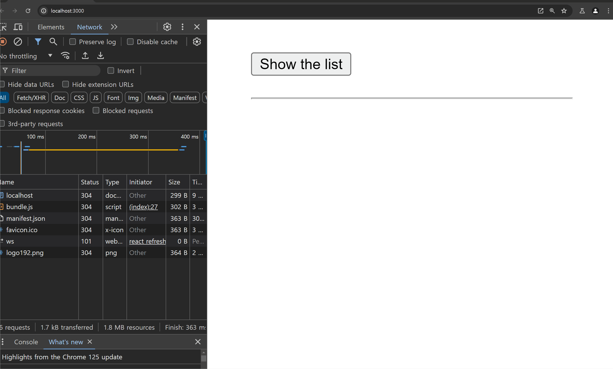
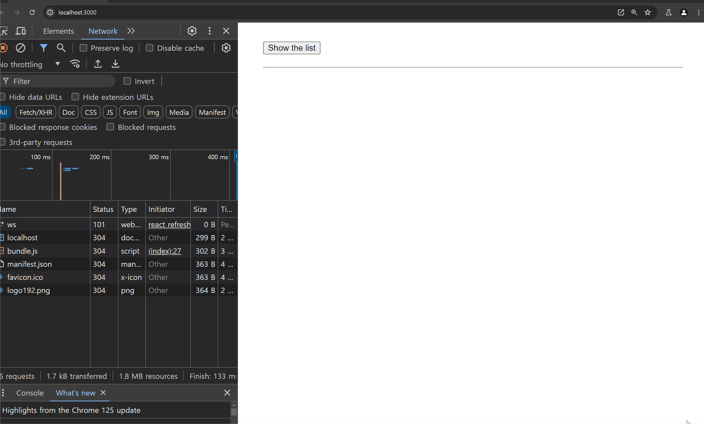

# `Suspense` 컴포넌트 배우기

---

> 대부분의 내용은 리액트 공식 문서를 참고하였다.
> https://react.dev/reference/react/Suspense

`React Challenge` 를 풀던 도중 `React.lazy , Suspense` 에 대한 내용이 있어

처음 보는 구성이라 공식문서를 살펴보았다.

```jsx
<Suspense fallback={<Loading />}>
  <SomeComponent />
</Suspense>
```

`Suspense` 컴포넌트는 다음과 같은 역할을 한다.

`children` 에 포함되는 컴포넌트가 렌더링 될 준비가 안됐다면 `fallback` 에 할당된 컴포넌트를 렌더링 하고

`children` 에 포함되는 컴포넌트가 렌더링 될 준비가 됐다면 이후엔 `children` 컴포넌트를 렌더링 한다.

이 때 `children` 에 들어갈 수 있는 컴포넌트는 대부분 다음과 같은 조건을 만족한다.

- Data fetching with Suspense-enabled frameworks like `Relay` and `Next.js`
- Lazy-loading component code with `lazy`
- Reading the value of a Promise with `use`

`children` 에 들어갈 수 있는 컴포넌트는 `Promise` 로 감싸져있거나

`thenable` 한 객체로 감싸져있어야 한다.

사실 이렇게 개념만 봐서는 잘 이해가 안간다. 코드를 통해 이해해보자

# 사용 예시를 통해 살펴보기

---

## `lazy loading` 과 함께 사용하여 번들 사이즈 줄이기

---

```jsx
function App() {
  const [isShow, setIsShow] = useState(false);
  const handleClick = () => {
    setIsShow((prev) => !prev);
  };
  return (
    <div className='App'>
      <button onClick={handleClick}>Show the list</button>
      <hr />
      {isShow && (
        {/* 로딩중일 때는 Loading 컴포넌트 렌더링 */}
        <Suspense fallback={<Loading />}>
          <Content /> {/* 해당 컴포넌트는 lazy loading */}
        </Suspense>
      )}
    </div>
  );
}
```

다음과 같은 컴포넌트가 존재 할 때 정의에 따라

`Suspense` 컴포넌트 바운더리 내부에 존재하는 `children` 인 **`Content` 는 컴포넌트로 사용되었지만 사실 `thenable` 한 객체이다.**

어떻게 컴포넌트가 `thenable` 한 객체인가 ? 라는 생각이 들 수 있다.

이는 우리가 `App` 컴포넌트가 호출되어 렌더링 될 때 가장 상단에 존재하는 `import , from ..` 을 통해

**미리 정적으로 컴포넌트들을 `import` 해오는 것에 익숙하기 때문이다.**

```jsx
import { Suspense, lazy, useState } from 'react';
import Loading from './components/Loading.jsx'; // 정적으로 Loading 컴포넌트 import

/**
 * 해당 함수는 네트워크 지연을 표현하기 위한 보일러 플레이트 코드이다.
 */
const delayedPromise = (promise) => {
  return new Promise((res) =>
    setTimeout(() => {
      res(promise);
    }, 2000),
  );
};

/**
 * Content 컴포넌트는 lazy 메소드로 감싸져있는 Promise 객체이다.
 * 이는 Content 컴포넌트가 파일이 읽힐 때 import 되는 것이 아니라
 * 호출 될 대 동적으로 import 하도록 한다.
 */
const Content = lazy(() => delayedPromise(import('./components/Content.jsx')));

function App() {
  ...
```

`import` 문을 보면 차이를 볼 수 있듯

`Loading` 컴포넌트는 `from , import ..` 문을 통해 **파일이 읽히는 동시에 정적으로 `import` 해오는 모습** 을 볼 수 있다.

하지만 `Content` 컴포넌트는 `lazy` 메소드로 감싸져있어 , 해당 컴포넌트는 `Content` 가 호출 될 때 **동적으로 `import` 된다.**



실제 예시를 살펴보면 `Content` 객체가 호출 될 때 네트워크 요청이 가는 모습을 볼 수 있다.

**이렇게 동적 `import` 를 사용하면 좋은 점은 번들의 사이즈를 줄일 수 있다는 점이다.**

만약 어떤 거대한 컴포넌트가 조건부적으로 렌더링 되어

페이지에 렌더링 될지 말지 모르는 상황에서 무조건 적으로 해당 컴포넌트를 정적으로 렌더링 해오는 행위는

전체 컴포넌트의 렌더링 시간을 지연시킨다.

차라리 조건부적으로 렌더링 되는 컴포넌트는 `lazy , Suspense` 를 이용하여 동적으로 `import` 를 함으로서

전체 렌더링 시간을 최소화 시키는 방법을 이용 할 수 있다.

## 데이터를 패칭해오는 컴포넌트와 `Suspense`

---

그래 알았어, `lazy` 를 이용하여 동적으로 `import` 해옴으로서 조건부적으로 렌더링 될 컴포넌트를 미리 `import` 해오지 않는 방법을 사용하는구나 ?

그럼 `Suspense` 를 이용해 데이터를 패칭해오는 컴포넌트가 로딩 상태임을 보여 줄 수도 있나 ?

하는 생각이 든다.

공식 문서를 살펴보자

> **Suspense does not detect when data is fetched inside an Effect or event handler.**

`Suspense` 는 내부에 존재하는 `children` 컴포넌트의 패칭 상태를 추적하지 않는다고 한다.

만약 패칭 상태를 추적하고 싶다면 연동이 되는 라이브러리나 프레임 워크를 사용하라고 한다.

이게 어떤 것을 의미하는지 체험해보자

우선 데이터를 패칭해오기 위해 시나리오를 조금 수정해보자

### 시나리오 설정

---

```jsx
const delay = (ms) => {
  return new Promise((res) =>
    setTimeout(() => {
      res(null);
    }, ms),
  );
};

const Content = () => {
  const [posts, setPosts] = useState([]);
  useEffect(() => {
    const fetching = async () => {
      const response = await fetch(
        'https://jsonplaceholder.typicode.com/posts?userId=1',
      );
      await delay(2000); // delay 를 위한 코드
      const json = await response.json();
      setPosts(json);
    };
    fetching();
  }, []);
  return (
    <ContentView>
      <ul>
        {posts.map(({ id, title }) => (
          <li key={id}>{title}</li>
        ))}
      </ul>
    </ContentView>
  );
};

export default Content;
```

다음과 같이 `Content` 컴포넌트는 `useEffect` 를 이용하여 데이터 요청을 보내고

`posts` 의 상태가 업데이트 되면 게시글들을 렌더링 한다.

```jsx
import { Suspense, useState } from 'react';
import Loading from './components/Loading.jsx';
import Content from './components/Content.jsx'; // 정적 import 로 변경

function App() {
  const [isShow, setIsShow] = useState(false);
  const handleClick = () => {
    setIsShow((prev) => !prev);
  };
  return (
    <div className='App'>
      <button onClick={handleClick}>Show the list</button>
      <hr />
      {isShow && (
        <Suspense fallback={<Loading />}>
          <Content />
        </Suspense>
      )}
    </div>
  );
}

export default App;
```


다음과 같이 있을 때 `Suspense` 바운더리에 있는 `Content` 의 패칭 여부에 상관 없이

`Content` 컴포넌트는 로딩창 없이 즉시 마운트 된다.

공식문서에서 말하는데로 `Suspense` 그 자체만으로는 데이터 패칭 여부를 감지하지 못한다.

# `Suspense` 는 도대체 어떻게 준비 여부를 파악할까 ?

---

그렇다면 의문이 든다.

`Suspense` 는 `lazy` 로 감싸져있는 동적 `import` 같은 경우는 준비 상태 여부를 파악하고

`import` 가 모두 끝나면 컴포넌트를 렌더링 했다.

하지만 일반적인 `useEffect` 를 이용하여 데이터를 `fetching` 해오는 일반적인 컴포넌트에선 준비 상태 여부를 감지하지 못한다.

도대체 `Suspense` 컴포넌트는 어떤 방식으로 동작하는 걸까 ?

`Suspense` 가 작동하는 순서를 생각해보자

```jsx
/* 2. 준비되지 않았다면 준비하는 동안 fallback 컴포넌트 렌더링 */
<Suspense fallback={<Loading />}>
  /* 1. Children 컴포넌트가 준비 되었는지 확인 */
  <Content />
</Suspense>
```

`Suspense` 컴포넌트는 **`children` 컴포넌트가 준비 되었는지를 확인**하고 ,

준비 되지 않았다면 비동기적으로 준비 시킨다.

이 때 **비동기적으로 준비 시키는 동안** 모든 렌더링 과정을 멈추는게 아니라

**`fallback` 에 존재하는 컴포넌트를 렌더링** 하고 비동기적으로 준비가 완료되면 준비가 완료된 `children` 컴포넌트를 렌더링 한다.

그럼 의문이 든다.

**`children` 컴포넌트가 준비 되었는지를 어떻게 확인할까 ?**

그것은 바로 **`children` 컴포넌트가 렌더링 될 때 `throw` 하는 `Promise` 객체를 `Suspense` 컴포넌트가 캐치 하는 것이다.**

`Suspense` 입장에서 만약 `children` 컴포넌트가 `Promise` 객체를 `throw` 했다면

본인을 렌더링 하기 위한 데이터가 준비 되지 않았음을 알린 것이기에 해당 `Promise` 객체가 `settled` 될 때 까지

`fallback` 에 할당된 컴포넌트를 렌더링 한다.

만약 `throw` 하는 `Promise` 객체나 `thenable` 객체가 없다면 `children` 컴포넌트의 렌더링을

`suspened` 시킬 이유가 없기 때문에 바로 렌더링 한다.

```jsx
const Content = () => {
  const [posts, setPosts] = useState([]);
  useEffect(() => {
    const fetching = async () => {
      const response = await fetch(
        'https://jsonplaceholder.typicode.com/posts?userId=1',
      );
      await delay(2000); // delay 를 위한 코드
      const json = await response.json();
      setPosts(json);
    };
    fetching();
  }, []);
  return (
    <ContentView>
      <ul>
        {posts.map(({ id, title }) => (
          <li key={id}>{title}</li>
        ))}
      </ul>
    </ContentView>
  );
};

export default Content;
```

위 예시에서 `Content` 컴포넌트는 `Suspense` 컴포넌트에게 아무런 객체도 `Throw` 하지 않기에

`Suspense` 컴포넌트는 `Content` 렌더링을 지연 시킬 필요 없이 바로 렌더링 해버린다.

다음과 같이 변경하면 `Content` 컴포넌트가 준비 될 때 까지 렌더링을 지연 시킬 수 있다.

이 또한 코드 예시를 통해 살펴보자

### 코드 여부로 살펴보는 `Suspense` 와 `API` 호출

```jsx
const Content = () => {
  const posts = suspenderMaker.read(); //  비동기 처리로 데이터를 받아오는 함수

  return (
    <ContentView>
      <ul>
        {posts.map(({ id, title }) => (
          <li key={id}>{title}</li>
        ))}
      </ul>
    </ContentView>
  );
};

export default Content;
```

변경된 컴포넌트에선 예전처럼 `useState , useEffect` 와 같은 상태 관리 로직이 존재하지 않는다.

`suspenderMaker.read` 메소드를 호출하여 `posts` 데이터를 받아온다.

```jsx
const suspenderMakerFn = () => {
  let result; // 1. 데이터를 저장할 변수
  let state = 'pending'; // 2. 패칭 상태를 저장할 변수
  const fetching = async () => {
    //  3. fetching 함수는 Promise 객체를 반환하는 fetch 함수
    try {
      const response = await fetch(
        'https://jsonplaceholder.typicode.com/posts?userId=1',
      );
      await delay(2000); // delay 를 위한 코드
      const json = await response.json();
      state = 'fulfilled';
      result = json;
    } catch (e) {
      state = 'error';
      result = e;
    }
  };

  return {
    // 4. 반환되는 객체는 suspenderMakerFn 에 저장된 값을 기억하는
    // 클로저 함수
    read() {
      switch (state) {
        // 5. state 값에 따라 반환하는 객체가 다르다.
        case 'pending':
          throw fetching();
        case 'error':
          throw result;
        default:
          return result;
      }
    },
  };
};

const suspenderMaker = suspenderMakerFn();

const Content = () => {
  const posts = suspenderMaker.read(); //  비동기 처리로 데이터를 받아오는 함수
  ...
```



다음과 같이 `suspenderMakerFn` 를 살펴보면 `Content` 컴포넌트가 렌더링 될 때

데이터를 패칭해온 것이 없다면 `Suspense` 에게 `fetching()` 을 `throw` 함으로서 `Promise` 객체를 캐치하도록 한다.

이에 `Suspense` 는 캐치된 `Promise` 객체가 `settled` 되기 전까지 `Content` 컴포넌트의 렌더링을

지연시켜둔다.

이후 `settled` 되면 비로소 `posts` 에 패칭된 값이 할당되고 이후의 로직들이 실행되며

반환되는 컴포넌트를 렌더링 한다.

되게 복잡해보이는데 `Suspense` 컴포넌트와 서드파티 라이브러리를 사용하면

단순히 커스텀훅을 이용하는 것처럼 쉽게 사용 할 수도 있다. `react-query` 에서 그런 기능을 제공한다고 하더라

# `Suspense` 를 이용해 데이터를 패칭해오는 것의 장점

---

### 컴포넌트의 단일 책임 원칙을 지킬 수 있다.

---

만약 `Suspense` 를 사용하지 않고 로딩 상태를 구현하고 싶었다면 `Content` 컴포넌트를 다음처럼 구성해야 했을 것이다.

```jsx
const Content = () => {
  const [posts, setPosts] = useState([]);
  // 로딩 상태를 관리하기 위한 상태 추가
  const [isSettled, setIsSettled] = useState(false);
  useEffect(() => {
      /*이전과 동일하여 생략 */
      setPosts(json);
      setIsSettled(true);
    };
    fetching();
  }, []);

  // isSettled 상태 여부에 따라 조건부 렌더링
  if (!isSettled) return <Loading />;
  return (
    <ContentView>
      <ul>
        {posts.map(({ id, title }) => (
          <li key={id}>{title}</li>
        ))}
      </ul>
    </ContentView>
  );
};

export default Content;
```

다음처럼 컴포넌트 내부에서 `Settled` 여부에 따라 조건부적으로 렌더링 해야 하여

`Content` 컴포넌트의 역할이 불분명해진다.

```jsx
<Suspense fallback={<Loading />}>
  <Content />
</Suspense>
```

```jsx
const suspenderMaker = suspenderMakerFn();

const Content = () => {
  const posts = suspenderMaker.read();

  return (
    <ContentView>
      <ul>
        {posts.map(({ id, title }) => (
          <li key={id}>{title}</li>
        ))}
      </ul>
    </ContentView>
  );
};
```

하지만 다음처럼 조건부 렌더링 로직을 `Suspense` 컴포넌트에게 위임함으로서

단순히 `Content` 컴포넌트는 페칭해온 값을 이용해 렌더링 한다 라는 단일 책임 역할을 지킬 수 있다.

### `nesting Suspense` 을 통해 로딩 상태에 따른 조건부 로직을 계층적으로 관리 할 수 있다.

---

백문이 불여일견이라고 하단 깃허브 공식 문서의 예시를 통해 계층적 조건부 로직을 살펴보자

https://react.dev/reference/react/Suspense#revealing-nested-content-as-it-loads

# `Suspense` 는 그럼 만능일까 ?

---

`Suspense` 는 `React v18` 에 나온 비교적 최신 버전의 기능이다.

이에 아직 지원되지 않는 서드파티 라이브러리도 많을 뿐더러

발견되지 않은 버그들이 존재 할 수 있기 때문에 조심히 기다리는 사람들도 많더라

# 회고

---

나는 개인적으로 해당 기능이 매우 마음에 든다 !

어떻게 해야 컴포넌트들을 최대한 독립적인 구조로 잘 유지 할 수 있을까 ? 에 대한 고민이 있었는데

조금은 생각이 넓어진 느낌
