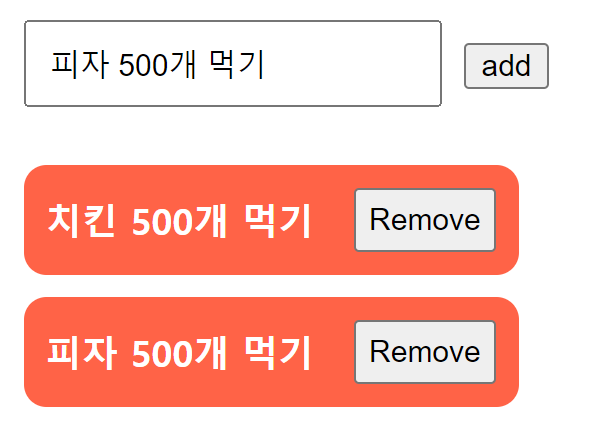

> 해당 내용은 해당 페이지들을 출처로 하여 작성되었다.
> https://www.npmjs.com/package/react-vac > https://wit.nts-corp.com/2021/08/11/6461

# `VAC` 패턴이란

---

`VAC` 패턴이란 데이터 , 컨트롤러 , 뷰 역할을 하는 시스템적인 아키텍쳐를 이야기 하는 디자인 패턴이라기 보다

컴포넌트의 렌더링 로직과 비즈니스 로직을 분리하기 위한

컴포넌트 설계 패턴에 가깝다.

`VAC` 는 `View Asset Component` 의 줄임말로

철저하게 `stateless` 하게 지어져 `props` 만으로 데이터를 렌더링 하는 역할만을 하는

컴포넌트를 의미한다.


`React` 를 사용하여 컴포넌트를 생성 할 때 `JSX` 를 활용하기 때문에

자바스크립트 코드만으로도 비즈니스 로직 뿐 아니라 `View` 를 위한 로직까지 처리 할 수 있다.

이런 확장성은 초기 설계의 편리함을 가져왔지만

`View` 와 비즈니스 로직이 함께 혼재하는 역할과 책임이 불분명한 컴포넌트를 생성하여 여러 문제를 야기했다.

# 시나리오

---

기존 패턴으로 간단한 투두리스트를 만들어 보고 `VAC` 패턴으로 리팩토링 하는 과정으로 `VAC` 패턴을 익혀보자

다만 몇 가지 조건을 걸자

- 현재 협업하는 개발자는 두 명으로 `UI 개발자` 와 `FE 개발자` 가 존재한다.
- 스타일링은 `assets/style.js` 에 담긴 스타일 객체에서 빼와 사용한다. (`CSS` 사용 X)

#### `App`

```tsx
import { useState } from 'react';
import { TodoType } from './components/Todo';

import TodoInput from './components/TodoInput';
import TodoList from './components/TodoList';

const App: React.FC = () => {
  const [text, setText] = useState<string>('');
  const [todos, setTodos] = useState<TodoType[]>([]);

  return (
    <div className='App'>
      <TodoInput
        text={text}
        todos={todos}
        setText={setText}
        setTodos={setTodos}
      />
      <TodoList todos={todos} setTodos={setTodos} />
    </div>
  );
};

export default App;
```

#### `Components/TodoInput`

```tsx
import { TodoType } from './Todo';
import style from '../assets/styles';
import { ChangeEvent } from 'react';

type Props = {
  text: string;
  setText: (newText: string) => void;
  todos: TodoType[];
  setTodos: (newTodos: TodoType[]) => void;
};

type TextChangeHandler = (event: ChangeEvent<HTMLInputElement>) => void;
type TodosAddHandler = () => void;

const TodoInput: React.FC<Props> = ({ text, todos, setText, setTodos }) => {
  const handleChange: TextChangeHandler = (e) => setText(e.target.value);

  const handleClick: TodosAddHandler = () => {
    setTodos([...todos, { id: todos.length, content: text }]);
  };

  return (
    <section>
      <input
        style={{ ...style.TodoInput }}
        type='text'
        onChange={handleChange}
      />
      <button onClick={handleClick}>add</button>
    </section>
  );
};

export default TodoInput;
```

#### `Components/TodoList`

```tsx
import { TodoType } from './Todo';
import Todo from './Todo';

import style from '../assets/styles';

type Props = {
  todos: TodoType[];
  setTodos: (updateFn: (prev: TodoType[]) => TodoType[]) => void;
};

const TodoList: React.FC<Props> = ({ todos, setTodos }) => {
  return (
    <ul style={{ ...style.TodoList }}>
      {todos.map((todo) => (
        <Todo todo={todo} setTodos={setTodos} />
      ))}
    </ul>
  );
};

export default TodoList;
```

#### `Components/Todo`

```tsx
import style from '../assets/styles';
import RemoveButton from './RemoveButton';

export type TodoType = {
  id: number;
  content: string;
};

type Props = {
  todo: TodoType;
  setTodos: (updateFn: (prev: TodoType[]) => TodoType[]) => void;
};

const Todo: React.FC<Props> = ({ todo, setTodos }) => {
  return (
    <li style={{ ...style.Todo }}>
      {todo.content}
      <RemoveButton id={todo.id} setTodos={setTodos} />
    </li>
  );
};

export default Todo;
```

#### `Components/RemoveButton`

```tsx
import { TodoType } from './Todo';
import style from '../assets/styles';

type Props = {
  id: number;
  setTodos: (updateFn: (prev: TodoType[]) => TodoType[]) => void;
};

type RemoveTodoHandler = () => void;

const RemoveButton: React.FC<Props> = ({ id, setTodos }) => {
  const handleClick: RemoveTodoHandler = () => {
    setTodos((prev) => prev.filter((todo) => todo.id !== id));
  };

  return (
    <button style={{ ...style.RemoveButton }} onClick={handleClick}>
      Remove
    </button>
  );
};

export default RemoveButton;
```

#### `assets/style`

```js
const style = {
  Todo: {
    padding: '10px',
    display: 'flex',
    justifyContent: 'space-between',
    alignItems: 'center',
    width: '200px',
    background: 'tomato',
    color: 'white',
    fontWeight: '900',
    margin: '10px',
    borderRadius: '10px',
  },
  RemoveButton: {
    padding: '5px',
  },
  TodoList: {
    padding: '0px',
  },
  TodoInput: {
    padding: '10px',
    margin: '10px',
  },
};

export default style;
```



### 기존 패턴의 문제점 찾기

---

다음과 같은 컴포넌트 구성이 있을 때 생각나는 문제는 두 가지 존재한다.

**1. `assets/style.js` 에서 스타일 객체를 가져와 `HTMLElement` 의 `attrbute` 로 직접 주입하는 것은 성능 좋지 않다.**

**2. 컴포넌트 내부에 렌더링 로직과 비즈니스 로직이 혼재한다.**

예를 들어 `RemoveButton` 컴포넌트를 살펴보자

```tsx
const RemoveButton: React.FC<Props> = ({ id, setTodos }) => {
  /* 비즈니스 로직 */
  const handleClick: RemoveTodoHandler = () => {
    setTodos((prev) => prev.filter((todo) => todo.id !== id));
  };

  /* 렌더링 로직 */
  return (
    <button style={{ ...style.RemoveButton }} onClick={handleClick}>
      Remove
    </button>
  );
};

export default RemoveButton;
```

한 컴포넌트 내부에 비즈니스 로직과 렌더링 로직이 함께 한다.

물론 현재의 컴포넌트는 매우 단순한 컴포넌트라 가독성이 크게 떨어지지 않으나

여전히 좋지 않은 컴포넌트 구성이며

`FE` 개발자와 `UI` 개발자의 협업시 충돌이 발생 할 수 있다.

예를 들어 `FE` 개발자가 `button onCliick` 에 들어갈 메소드를 변경하고

`UI` 개발자가 `button style` 에 들어갈 스타일 객체를 수정했다고 가정해보자

```tsx
    /* FE 개발자의 커밋과 UI 개발자의 커밋이 충돌 */
    <button style={{ ...style.RemoveButton }} onClick={handleClick}>
```

이 경우 두 개발자의 커밋이 충돌하여 문제가 발생할 수 있다.

이런 이유는 해당 컴포넌트를 관리하는 주체가 `UI , FE` 개발자 두 명이 함께 존재하기 때문이다.
