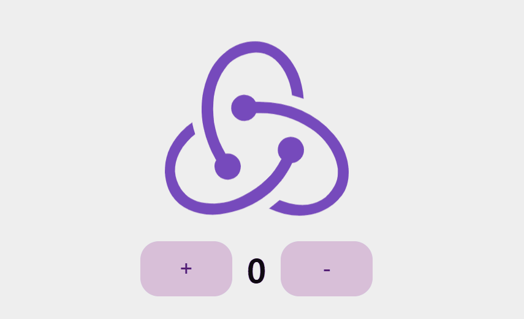
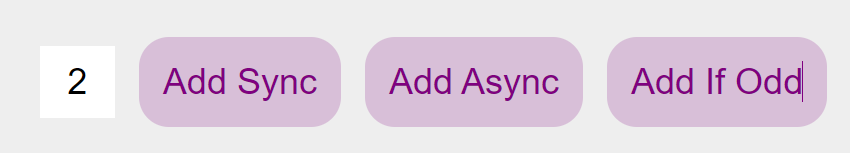

# `Redux` 튜토리얼 따라하기

---

해당 `docs` 는 리덕스 공식문서인 <a href = 'https://ko.redux.js.org/tutorials/essentials/part-2-app-structure'>Redux App Structure</a> 를 토대로 만들어졌습니다.

# 패키지 의존성

---

```dotnetcli
├── @reduxjs/toolkit@2.2.5
├── @testing-library/jest-dom@5.17.0
├── @testing-library/react@13.4.0
├── @testing-library/user-event@13.5.0
├── @types/jest@27.5.2
├── @types/node@16.18.97
├── @types/react-dom@18.3.0
├── @types/react-redux@7.1.33
├── @types/react@18.3.2
├── react-dom@18.3.1
├── react-redux@9.1.2
├── react-scripts@5.0.1
├── react@18.3.1
├── styled-components@6.1.11
├── typescript@4.9.5
└── web-vitals@2.1.4
```

`create-react-app --template typescript` 로 리액트 앱을 구성한 후 `redux , redux-toolkit` 을 설치해줍니다.

# `Redux` 가 아닌 `Redux-toolkit` 을 이용하는 이유

---

> ### Redux Toolkit
>
> Redux Toolkit is our recommended approach for writing Redux logic.
> It contains packages and functions that we think are essential for building a Redux app.
> Redux Toolkit builds in our suggested best practices, simplifies most Redux tasks, prevents common mistakes, and makes it easier to write Redux applications.
>
> https://ko.redux.js.org/tutorials/essentials/part-1-overview-concepts

`Redux Toolkit` (이하 `RTK`) 는 2019년 10월 `Redux` 팀에 의해서 도입된 라이브러리입니다.

`RTK` 는 `Redux` 공식 문서에서도 공식적으로 권장하는 방식으로 `Redux` 를 이용하기 위해 필요한

다양한 내장도구들이 기본적으로 장착되어 있으며 `Redux` 를 사용 할 때 작성해야 하는 상용구 코드들을 작성하면서 발생 할 수 있는 휴먼에러를 최소화하기 위해 단순화 되어있습니다.

따라서 `Redux` 에서 공식적으로 권장하는 `Redux-toolkit` 을 공부해보도록 하겠습니다.

# `--template redux UI` 구성하기

---

미리 `Redux` 의 사용 환경이 러프하게 구성되어 있는 `React App` 을 만들고 싶다면

```dotnetcli
npx create-react-app redux-essentials-example --template redux
```

터미널의 다음과 같은 문구를 입력하여 기본적인 `UI` 와 `Redux` 환경이 셋팅 되어 있는 리액트 앱을 생성 할 수 있습니다.

저는 이미 셋팅 되어 있는 튜토리얼을 뜯어보며 공부하기보다

직접 튜토리얼에 있는 로직을 공식문서를 살펴보며 직접 만들어보려 합니다.


```tsx
import Flex from 'components/Atoms/Flex';
import Count from 'components/Atoms/Count';
import ReduxLogo from 'components/Atoms/Logo';

import { AddButton, SubtractButton } from 'components/Mocules/CounterButton';
import InputCharCounter from 'components/Mocules/InputCharCounter';
import AsyncAddButton from 'components/Mocules/AsyncAddButton';
import SyncAddButton from 'components/Mocules/SyncAddButton';
import OddAddButton from 'components/Mocules/OddAddButton';

const Counter: React.FC = () => {
  return (
    <section>
      <Flex direction='column'>
        <ReduxLogo />
        <Flex>
          <AddButton /> {/* 1 씩 num 을 증가시키는 컴포넌트 */}
          <Count />
          <SubtractButton /> {/* 1 씩 num 을 감소시키는 컴포넌트 */}
        </Flex>
        <Flex>
          <InputCharCounter /> {/* Sync,AsyncAdd 버튼의 증가량 */}
          <SyncAddButton /> {/* 동기적으로 증가시키는 컴포넌트 */}
          <AsyncAddButton /> {/* 비동기적으로 증가시키는 컴포넌트 */}
          <OddAddButton /> {/* 증가량이 홀수라면 증가시키는 컴포넌트 */}
        </Flex>
      </Flex>
    </section>
  );
};

export default Counter;
```

최대한 `--template redux` 로 생성된 `UI` 와 비슷하게 생긴 모습을 구현해둡니다.

현재의 컴포넌트들에는 `state` 가 존재하지 않는 `stateless` 컴포넌트들이며 이제 `redux-toolkit` 을 이용해 전역 상태 환경을 셋팅해보려 합니다.

> `UI` 를 따라 만드는동안 `styled-component` 에 대해서 몰랐던 점을 더 배워갔습니다.
> `props` 에 `$` 사인을 붙이면 `props` 가 `HTMlAttribute` 에 붙는 것을 필터링 해줄 수 있군요

# `Redux Store` 구축하기

---

## `Redux` 의 패턴

---


이전 `docs` 에서 `Redux` 는 `Flux` 패턴과 유사한 데이터 흐름을 갖는다고 하였습니다.

`UI` 에서 발생한 상태 변경을 **액션 객체** 로 생성한 후

`store.dispatch` 를 이용해 **액션 객체** 를 받아 `store` 에 존재하는 **`Reducer`** 들에게 보내 새로운 `state` 를 생성합니다.

이후 새롭게 생성된 `state` 는 `store` 에 저장되고 `store` 에서 변경된 `state` 를 구독하고 있는 `UI` 에게 `re-rendering` 을 야기 합니다.

## `createSlice` 를 이용해 복잡한 `Reducer` 들을 쉽게 생성하자

`createSlice` 는 `RTK` 에서 `Redux` 의 `reducer logic , action` 과 관련된 로직이 담긴

`CreateSliceOptions` 객체를 인수로 받아 `Reducer , action creator` 등을 한 번에 생성합니다.

사실 문장만을 봐서는 잏해하기가 쉽지 않지만 추후 전체 완성된 환경을 살펴보면 이해가 쉬울 것입니다.

또 , 어려운 단어들이 등장해 (적어도 저는 단어들이 어렵더군요) 무지막지해보이지만 `Redux` 때의 보일러플레이트 코드를 보고 나면 마치 선녀처럼 보일 것입니다.

### `RTK` 가 아닌 `Redux` 일 때 `Reducer` 생성하는 방법

---

선녀같은 `RTK` 를 만나기 전 `Redux` 를 이용 할 때를 살펴봅시다.

`Redux` 를 이용하여 `Reducer` 들을 생성하기 위해선 다음과 같은 과정을 거쳐야 했습니다.

- 사용 할 `Action` 객체들의 `type` 지정하기

```tsx
// actionTypes.ts
export const INCREMENT = 'counter/increment';
export const DECREMENT = 'counter/decrement';
export const INCREMENT_BY_AMOUNT = 'counter/incrementByAmount';
```

- 액션 객체를 생성할 `Action Creators` 생성하기

```tsx
// actions.ts
import { INCREMENT, DECREMENT, INCREMENT_BY_AMOUNT } from './actionTypes';

export const increment = () => ({
  type: INCREMENT,
});

export const decrement = () => ({
  type: DECREMENT,
});

export const incrementByAmount = (amount) => ({
  type: INCREMENT_BY_AMOUNT,
  payload: amount,
});
```

해당 함수들은 `type:string , payload?: any` 타입의 액션 객체를 생성하는 액션 크리에이터 객체입니다.

해당 메소드로 호출된 액션 객체들은 `store.dispatch` 메소드에 의해 `Reducer` 들에게 건내집니다.

- `Reducer` 에서 사용할 초기 `state` 지정하기

```tsx
// initialState.js
export const initialState = {
  value: 0,
};
```

해당 `initalState` 는 `Reducer` 에서 사용할 초기 상태값을 담은 객체입니다.

- `Reducer` 정의하기

```tsx
// reducer.js
import { INCREMENT, DECREMENT, INCREMENT_BY_AMOUNT } from './actionTypes';
import { initialState } from './initialState';

const counterReducer = (state = initialState, action) =>; {
  switch (action.type) {
    case INCREMENT:
      return {
        ...state,
        value: state.value + 1,
      };
    case DECREMENT:
      return {
        ...state,
        value: state.value - 1,
      };
    case INCREMENT_BY_AMOUNT:
      return {
        ...state,
        value: state.value + action.payload,
      };
    default:
      return state;
  }
};

export default counterReducer;
```

이후 `intalState` 값을 기준으로 `action` 객체의 `type` 값에 따라 `state` 값을 순수 함수를 이용하여 변경하는 `Reducer` 들을 생성해줍니다.

이후 `Reducer` 들을 `store` 에 연결해주면 환경 셋팅은 완료됩니다.

지금의 코드들은 어떤가요 ?

대부분의 로직들이 유사한 코드들의 반복으로 이뤄져있는 것을 볼 수 있습니다.

액션 타입들을 지정해준다던지, 액션 크리에이터를 생성하는 등 말입니다.

또 순수 함수를 이용하는 것이 `state` 값을 변경해주는 행위가 데이터의 무결성을 유지시킬 수 있다는 점은 백번 이해하지만 안타깝게도 순수 함수는 우리에게 익숙하지 않습니다.

우리는 `{...state , value : state.value + 1}` 보단 `state.value += 1` 이 훨씬 익숙하고 편합니다.

### `Redux` 가 아닌 `RTK`의 `createSlice` 를 사용하기

---

```tsx
import { createSlice, PayloadAction } from '@reduxjs/toolkit';

type CounterState = {
  value: number;
};

const initialState: CounterState = {
  value: 0,
};

const SliceOptions = {
  name: 'counter',
  initialState,
  reducers: {
    increment: (state: CounterState) => {
      state.value += 1;
    },
    decrement: (state: CounterState) => {
      state.value -= 1;
    },
    incrementByAmount: (state: CounterState, action: PayloadAction<number>) => {
      state.value += action.payload;
    },
  },
};

export const counterSlice = createSlice(SliceOptions);
export const { increment, decrement, incrementByAmount } = counterSlice.actions;
```

`RTK` 에서 제공하는 `createSlice` 메소드는 `SliceOptions` 객체 하나만으로 충분합니다.

이렇게 `createSlice` 로 생성된 `Slice` 객체는 다음과 같이 생겼습니다.
`export const counterSlice = createSlice(SliceOptions)` 를 통해 생성된 `counterSlice` 객체는 다음과 같이 생겼습니다.

```tsx
/ * 생성된 Slice 객체 예시 */
{
  name: 'counter',
  initialState: { value: 0 },
  reducers: {
    increment: (state) => { state.value += 1; },
    decrement: (state) => { state.value -= 1; },
    incrementByAmount: (state, action) => { state.value += action.payload; },
  },
  actions: {
    increment: () => ({ type: 'counter/increment' }),
    decrement: () => ({ type: 'counter/decrement' }),
    incrementByAmount: (amount) => ({ type: 'counter/incrementByAmount', payload: amount }),
  },
  caseReducers: {
    increment: (state) => { state.value += 1; },
    decrement: (state) => { state.value -= 1; },
    incrementByAmount: (state, action) => { state.value += action.payload; },
  },
  reducer: (state, action) => { /* reducer logic */ }
  ...
}
```

`RTK` 와 `Redux` 의 `Reducer` 생성 방식의 가장 큰 차이점은 다음 두 가지일것입니다.

**1. `Action Type , Action Creator` 함수를 만들지 않아도 됩니다.**
**2. `Action Type` 별 `Reducer` 의 행동을 정의 할 필요 없습니다.**
**3. `state` 를 `mutable` 하게 변경 하듯 사용 할 수 있습니다.**

`RTK` 에서는 `name , reducers` 메소드의 이름을 이용해 액션 크리에이터 메소드를 생성합니다.

생성되는 액션 타입들은 `reducers` 의 메소드 이름을 사용하기 때문에 이제 앞으로 `reducer` 들이 `Action type` 별 분기문을 작성해줄 필요 없습니다. (`Redux` 에선 `switch case` 문을 사용했던 것을 기억해보세요)

**그저 단순하게 상태 변경 메소드들만 생성해두면 `RTK` 가 알아서 액션 크리에이터 , 분기 처리 모두 해줍니다.**

또 특징적인 것으로 `reducers` 내부의 함수는 `mutable` 하게 `state` 를 변경하는 것 처럼 보입니다.

그럼 `RTK` 는 `state` 를 `mutable` 하게 관리하는 걸까요 ?

그렇지 않습니다. 여전히 `immutable` 하게 관리합니다.

`RTK` 는 `immer` 라이브러리를 이용해 설계되었습니다. `immer` 는 `immutable` 하게 `state` 를 변경시키는 로직을 마치 `mutable` 하게 변경 할 수 있게 도와주는 라이브러리입니다.

우리는 그저 변경하고자 하는 `state` 의 로직에만 집중하면 됩니다. `immer` 가 알아서 불변성을 유지시켜 줄 것입니다.

우리는 이제 `store` 를 구성하기 위한 모든 요소를 생성했습니다.

액션 크리에이터도 준비되어 있고 , 액션 크리에이터 별 일어날 상태 변경 로직도 준비되었습니다.

또 관리 해야 할 `state` 인 `counter` 또한 준비되었습니다.

이제 준비된 `Slice` 들을 적절히 이용하여 `Store` 들을 생성해보도록 하겠습니다.

## `store` 생성하기

---

```tsx
import { configureStore } from '@reduxjs/toolkit';
import { counterSlice } from './CounterSlice';

const store = configureStore({
  reducer: {
    counter: counterSlice.reducer,
  },
});

export default store;
export type RootState = ReturnType<typeof store.getState>;
export type Dispatcher = typeof store.dispatch;
```

이전에 만들어둔 `counterSlice` 를 이용하여 `store` 를 생성해줍니다.

만일 관리 해야 할 `state, reducer` 들이 늘어난다면 `store` 에서 `reducer` 에 항목을 더 추가해주면 됩니다.

# 컴포넌트가 `Store` 상태를 구독 할 수 있도록 해주기

---

```tsx
import { Provider } from 'react-redux';
import Counter from './Counter/Counter';
import store from 'store/store';

import './App.css';
function App() {
  return (
    <div className='App'>
      <Provider store={store}>
        <Counter />
      </Provider>
    </div>
  );
}

export default App;
```

`redux-toolkit` 을 이용하여 `store` 를 생성해줬다면

`react-redux` 라이브러리의 `Provider` 컴포넌트를 이용해 `Provider` 의 자식 컴포넌트 모두에서 `store` 에 접근 할 수 있도록 해줍니다.

이제 `Counter` 컴포넌트에서 `store` 에 있는 상태를 사용하거나 , 변경하기 위해 액션 객체를 디스패칭 시키는 등의 행위가 가능해졌습니다.

# `Store` 내부의 `state` 를 받아 렌더링 하기

현재 `Store` 내부에 저장되어 있는 `state` 들의 생김새를 보도록 하겠습니다.

```tsx
console.log(store.getState());
```

```tsx
{
  counter: {
    value: 0;
  }
}
```

`counterSlice.reducer` 를 이용하여 `store` 를 생성해뒀기 때문에 `store` 의 `state` 객체에는

`counterSlice.initialState` 값이 들어가 있는 모습을 볼 수 있습니다.

따라서 `store` 에 존재하는 `state.counter.value` 값에 접근하려면 다음과 같은 방법을 사용 할 수 있습니다.

```tsx
import styled from 'styled-components';
import store, { RootState } from 'store/store';

const CountView = styled.h1`
  font-size: 36px;
`;

const Count = () => {
  /* getState 를 이용해 전체 store.state 를 호출 */
  const totalState: RootState = store.getState();
  const num = totalState.counter.value;

  return <CountView>{num}</CountView>;
};

export default Count;
```

하지만 이 방법은 올바른 방법이 아닙니다.

`store.getState` 메소드는 그저 단순히 `store` 의 `state` 를 가져오는 `get` 메소드일 뿐

해당 컴포넌트가 `store` 의 `state` 값을 구독 할 수 없습니다.

즉, `store.getState` 로 가져온 `state` 를 이용하는 컴포넌트는 `state` 가 변경되더라도 리렌더링이 일어나지 않습니다.

이에 상태 값을 가져오면서 해당 상태 값을 구독 시킬 수 있는 커스텀 훅을 `redux` 에서 제공합니다.

```tsx
import styled from 'styled-components';

import { useSelector } from 'react-redux';
import { RootState } from 'store/store';

const CountView = styled.h1`
  font-size: 36px;
`;

const Count = () => {
  /* useSelector 훅으로 Count 컴포넌트가 state.counter.value를 구독 할 수 있게 함 */
  const num = useSelector((state: RootState) => state.counter.value);

  return <CountView>{num}</CountView>;
};

export default Count;
```

`useSelector` 함수는 두 가지 매개변수를 받습니다.

현재의 `state` 에서 받고자 하는 값만을 반환하는 콜백함수인 `selector` 와 `selector` 에서 조건부적으로 값을 가져오게 해주는 `equalityFnOrOptions` 이 있습니다.

_두 번째 인수는 조건부적이며 해당 내용은 추후 `dispatcher` 부착 후 다루도록 하겠습니다._

`redux` 에서 제공하는 `useSelector` 훅을 이용하여 `Store` 에 존재하는 상태 값을 `Count` 컴포넌트에서 사용 할 수 있게 해뒀습니다.

이제 `Count` 컴포넌트는 `store.counter.value` 값이 변경 될 때 마다 리렌더링이 일어날 것입니다.

# 컴포넌트에서 액션 객체 생성하여 `store.dispatch` 시키기

---

위에서 컴포넌트가 `store.state` 를 구독 할 수 있게 했습니다.

그렇다면 이제 컴포넌트에서 `store` 의 상태를 변경 시킬 수 있도록 액션 객체를 생성하고 , `store` 에서 `dispatching` 시키겠습니다.


`+ , -` 버튼에 해당하는 `AddButton , SubtractButton` 에서 먼저 부착시켜보겠습니다.

```tsx
import { increment, decrement } from 'store/CounterSlice';
import store from 'store/store';

export const AddButton = () => {
  const handleClick = () => {
    /* counterSlice 에서 생성한 액션 크리에이터 함수로 액션 객체 생성
    { type: 'counter/increment' }
    */
    const action = increment();
    /* 생성한 액션 객체를 store 에서 dispatch */
    store.dispatch(action);
  };

  return (
    <Button width={'200'} onClick={handleClick}>
      +
    </Button>
  );
```

이전에 `counterSlice` 에서 생성한 액션 크리에이터 함수를 이용해 액션 객체를 생성하여

`store` 에서 `dispatching` 시켜줍니다.

물론 이렇게 해도 작동은 잘 되지만 이 과정을 추상화시킨 커스텀 훅을 `redux` 에서 제공합니다.

```tsx
import Button from '../Atoms/Button';

import { increment, decrement } from 'store/CounterSlice';
import { useDispatch } from 'react-redux';

export const AddButton = () => {
  const dispatch = useDispatch();

  const handleClick = () => {
    dispatch(increment());
  };

  return (
    <Button width={'200'} onClick={handleClick}>
      +
    </Button>
  );
};

export const SubtractButton = () => {
  const dispatch = useDispatch();
  const handleClick = () => {
    dispatch(decrement());
  };

  return (
    <Button width={'200'} onClick={handleClick}>
      -
    </Button>
  );
};
```

다음과 같이 `useDispatch` 를 통해 `Dispatcher` 를 받아 액션 크리에이터로 생성되는 액션 객체들을 디스패칭 해줄 수 있습니다.



# 액션 객체에 `payload` 값 넣기



이제 하단에 존재하는 로직을 완성시키도록 하겠습니다.

````tsx
          <InputCharCounter /> {/* Sync,AsyncAdd 버튼의 증가량 */}
          <SyncAddButton /> {/* 동기적으로 증가시키는 컴포넌트 */}
          <AsyncAddButton /> {/* 비동기적으로 증가시키는 컴포넌트 */}
          <OddAddButton /> {/* 증가량이 홀수라면 증가시키는 컴포넌트 */}
          ```
````

`InputCharCounter` 에서 입력된 값을 `payload` 로 하여 `Sync,AsyncAddButton , OddAddButton` 에서 액션 객체를 생성하여

`store` 에 디스패칭 시켜줘야 합니다.

### `Amount` 전역 상태 생성하기

---

사실 모든 상태 값을 `Redux` 에서 관리 할 필요는 없습니다.

지역적으로 관리 되어야 할 `state` 는 컴포넌트 내부에서 `useState` 를 이용해 컴포넌트 내부에서만 관리 해줄 수 있으나

제가 준비한 예시에서는 컴포넌트들을 분리해뒀기 때문에 `InputCharCounter` 에서 관리 될 `state` 를 다른 컴포넌트에서도 사용 가능하도록 전역 `state` 에 추가해주도록 하겠습니다.

```tsx
export const amountSlice = createSlice({
  name: 'amount',
  initialState: 0,
  reducers: {
    changeAmount: (state, action: PayloadAction<number>) => {
      return action.payload;
    },
  },
});

export const { changeAmount } = amountSlice.actions;
```

해당 `reducer` 는 `InputCharAmount` 에 적힌 값을 `payload` 에 받아 해당 `payload` 를 `state` 에 저장하는 리듀서입니다.

다만 의문이 듭니다. 여기서는 왜 `return action.payload` 를 했을까요 ?

`state = action.payload` 로 해도 알아서 `Immer` 가 `immutable`하게 변경해주는 것이 아닐까요 ?

그렇지 않습니다.

값을 변경하는 행위는 `Immer` 에서 변경해주지만, 값을 할당하는 행위는 새로운 상태를 반환하지 않는 것으로 간주하는 것이기 때문에 `state` 값을 다시 할당하는 경우에는

`Immutable` 한 방식으로 적어줘야 합니다.

```tsx
import { configureStore } from '@reduxjs/toolkit';
import { counterSlice, amountSlice } from './CounterSlice';

const store = configureStore({
  reducer: {
    counter: counterSlice.reducer,
    amount: amountSlice.reducer,
  },
});

export default store;
export type RootState = ReturnType<typeof store.getState>;
export type Dispatcher = typeof store.dispatch;
```

이로서 `store` 에서 관리할 `state` 는 두 가지 종류가 되었습니다.

```tsx
import Input from 'components/Atoms/Input';

import { useSelector, useDispatch } from 'react-redux';
import { RootState } from 'store/store';
import { changeAmount } from 'store/CounterSlice';

const InputCharCounter = () => {
  const dispatch = useDispatch();

  const increseAmount = useSelector((state: RootState) => state.amount);
  const handleChange: React.ChangeEventHandler<HTMLInputElement> = (e) => {
    dispatch(changeAmount(Number(e.target.value)) || 0);
  };

  return <Input defaultValue={increseAmount} onChange={handleChange} />;
};

export default InputCharCounter;
```

`InputCharCounter` 컴포넌트에서 값이 입력 될 때 마다 `store` 내부에 존재하는 `store.amount` 값은 변경됩니다.

# `store` 를 구독하지 않고 값을 받아 동기적으로 디스패칭 하기

---

```tsx
import Button from 'components/Atoms/Button';
import store from 'store/store';
import { incrementByAmount } from 'store/CounterSlice';

import { useDispatch } from 'react-redux';

const SyncAddButton = () => {
  const dispatch = useDispatch();
  const handleClick: React.MouseEventHandler<HTMLButtonElement> = () => {
    /* amount 를 구독하지 않고 가져오기 */
    const { amount } = store.getState();
    /* 가져온 값을 이용해 액션 객체 생성하기
    {
      type : counter/incrementByAmount,
      payload : amount
    }
    */
    dispatch(incrementByAmount(amount));
  };

  return <Button onClick={handleClick}>Add Sync</Button>;
};

export default SyncAddButton;
```

다음과 같이 `SyncAddButton` 컴포넌트를 구현해줄 수 있습니다.

여기서 중요한 점은 `amount` 라는 전역 상태 값을 `store.getState()` 를 이용해 가져온 것입니다.

`useSelector` 를 이용해서 값을 가져오게 되면 `SyncAddButton` 은 `amount` 값을 구독하게 되기 때문에 `amount` 값이 변경되면 리렌더링이 일어나게 됩니다.

하지만 `store.getState()` 를 이용해 `store` 값에 직접 접근하게 되면 `amount` 값을 구독하지 않으면서 해당 값을 사용 할 수 있습니다.

# `store` 를 구독하지 않고 값을 받아 비동기적으로 디스패칭 하기

---

`AddSyncButton` 은 액션 객체를 동기적으로 생성하여 디스패칭 하는 컴포넌트입니다.

`AddASyncButton` 은 액션 객체를 **비동기적으로 생성** 하여 디스패칭 하기를 바라는 컴포넌트입니다.

> 현재의 설계에선 `AddSyncButton` 이 2초 후 작업이 완료되는 것으로 설계되어있습니다.

기존 `Redux` 에서는 디스패칭되는 액션 객체는 순수한 자바스크립트 객체로만 제한 시켰습니다.

비동기 처리나 조건부적인 디스패칭은 예측 불가능한 아키텍쳐를 야기하고 단위 테스트를 불가능하게 만들기 때문입니다.

그래서 기존 `Redux` 에서 비동기적 디스패칭이나 조건부적 디스패칭을 하기 위해서는

`redux-thunk` 라는 라이브러리를 받아 `store` 미들 웨어에 추가해줘야 했습니다.

### 미들웨어가 뭘까 ?

---

미들웨어란 `action -> store.dispatch(reducer)` 로 액션 객체가 전달되는 과정에서 사이에 존재하는 로직을 의미합니다.

`action -> middleware -> store.dispatch(reducer)` 로 데이터 흐름 과정 속에 미들 웨어를 추가해줌으로서 `store` 에 부가적인 기능을 추가해줍니다.

예를 들어 `looger` 미들 웨어를 추가해보도록 하겠습니다.

```tsx
import { Middleware, MiddlewareAPI } from '@reduxjs/toolkit';

const loggerMiddleware: Middleware =
  (store: MiddlewareAPI) => (next) => (action) => {
    console.log('Dispatching action:', action);
    console.log('State before action:', store.getState());
    const result = next(action);
    console.log('State after action:', store.getState());
    return result;
  };

const store = configureStore({
  reducer: {
    counter: counterSlice.reducer,
    amount: amountSlice.reducer,
  },
  middleware: (getDefaultMiddleware) =>
    getDefaultMiddleware().concat(loggerMiddleware),
});
```

`loggerMiddleware` 함수는 3가지 함수로 이뤄진 `HOF (Higher Order Function)` 입니다.

3가지 함수로 이뤄져있는데 차근 차근 단계 별로 내려가보겠습니다.

```tsx
store => ..
```

가장 밖에 있는 고차 함수는 전역 상태 저장소인 `store` 를 인수로 받아 하위 함수들에게 넘겨줍니다.

```tsx
store => next => ..
```

중간에 존재하는 고차 함수는 `next` 를 인수로 받아 하위 함수로 전달해줍니다.

이 때 `next` 는 다음 미들웨어 혹은 `store.disptach` 로 호출 될 `reducer` 들을 의미합니다.

```tsx
(store) => (next) => (action) => {
  console.log('Dispatching action:', action);
  console.log('State before action:', store.getState());
  const result = next(action);
  console.log('State after action:', store.getState());
  return result;
};
```

가장 하위에 존재하는 함수는 `action` 객체를 받아 실행됩니다.

`next(actoin)` 을 전 후로 변경되기 전, 후의 `store` 의 상태를 로깅합니다.

이 때 이전 미들웨어에서 `next` 메소드로 현재의 미들 웨어를 호출 할 때를 대비하여 `result` 값을 반환하도록 합니다.

이를 통해 미들웨어 체인을 유지하는 `middleware chaining` 을 유지합니다.

### `redux-thunk` 미들웨어

---

미들웨어를 체인에 추가해줌으로서 기본 `store` 보다 더 강화된 형태인 `EnhancedStore` 를 만들 수 있음을 알 수 있었습니다.

그렇다면 `redux-thunk` 미들웨어는 무엇일까요 ?

`redux-thunk` 미들웨어는 `store.disptach` 에서 액션 객체가 아닌 함수를 객체로 받을 수 있도록 합니다.

사용 방법을 먼저 살펴보고 , `redux-thunk` 가 작동하는 과정을 보도록 하겠습니다.

```tsx
import { createStore, applyMiddleware } from 'redux';
import ReduxThunk from 'redux-thunk';

const store = createStore(modules, applyMiddleware(ReduxThunk));
```

`Redux` 에서 `redux-thunk` 를 적용하기 위해선 다음과 같은 방식으로 `store` 를 생성합니다.

그렇다면 적용되는`ReduxThunk` 는 어떻게 생겼을까요 ?

다음과 같이 생겼습니다.

```tsx
function createThunkMiddleware(extraArgument) {
  return ({ dispatch, getState }) =>
    (next) =>
    (action) => {
      if (typeof action === 'function') {
        return action(dispatch, getState, extraArgument);
      }

      return next(action);
    };
}

const thunk = createThunkMiddleware();
thunk.withExtraArgument = createThunkMiddleware;

export default thunk;
```

`ReduxThunk` 는 전달받는 `action` 객체가 함수 일 때 해당 `action` 함수가 실행시키고 반환합니다.

즉 , `redux-thunk` 가 사용되기를 원하는 `action` 함수는 `(dispatch , getState , extraArgument)` 를 이용하여 디스패칭 해야 합니다.

## 다시 본문으로 돌아와 , `redux-thunk` 를 이용해 비동기 적으로 디스패칭 하기

`RTK` 에선 `redux-thunk` 미들 웨어가 이미 내부적으로 존재합니다.

그렇기 때문에 따로 `store` 를 생성할 떄 `applyMiddleware` 를 이용해 적용 시켜줄 필요 없이

액션 객체를 함수 형태로 전달해주면 , 알아서 함수를 실행하고 `dispatchng` 합니다.

```tsx
export const incrementAsync = () => (dispatch: Dispatch) => {
  const { amount } = store.getState();
  setTimeout(() => {
    dispatch(incrementByAmount(amount));
  }, 2000);
};
```

다음과 같이 비동깆적으로 값을 `dispatching` 하는 함수를 반환하는 `incrementAsync` 함수를 생성했습니다.

`incrementAsync` 함수의 반환값을 `dispatch` 시키면 `redux-thunk` 내부에 존재하는 조건문인

```tsx
if (typeof action === 'function') {
  return action(dispatch, getState, extraArgument);
}
```

가 실행되면서 비동기적으로 액션 객체가 디스패칭 될 수 있게 합니다.


말은 뭔가 엄청나게 어렵지만 간단하게 **객체가 아닌 어떤 로직을 처리하고싶다면 해당 로직을 담은 함수를 `dispatch` 시키면 해당 로직 내부에서 로직 처리 후 `dispatch` 를 가능하게 합니다.**

# 조건문을 이용하여 디스패칭 하기

이제 마지막인 `OddAddButton` 컴포넌트에서 `dispatching` 로직만 완성하면 됩니다.

`oddAddButton` 이 클릭되면 다음과 같은 일이 일어나야 합니다.

1. 현재 `amount` 가 홀수인지 확인한다.
2. 홀수일 경우엔 동기적으로 디스패칭 하고
3. 홀수가 아닐 경우엔 디스패칭 하지 않는다.

이제 이런 로직은 `redux-thunk` 를 이용하여 처리해야 할 것으로 눈치 챌 수 있습니다.

```tsx
export const incrementOdd = () => (dispatch: Dispatch) => {
  const { amount } = store.getState();
  console.log(amount);
  if (amount % 2 !== 0) {
    dispatch(incrementByAmount(amount));
  }
};
```

다음과 같이 조건문을 이용하여 `dispatching` 시키는 로직을 담은 `incrementOdd` 메소드를 생성해줍니다.

```tsx
import Button from 'components/Atoms/Button';
import { useDispatch } from 'react-redux';

import { Dispatcher, incrementOdd } from 'store/store';

const OddAddButton = () => {
  const dispatch = useDispatch<Dispatcher>();
  const handleClick = () => {
    dispatch(incrementOdd());
  };

  return <Button onClick={handleClick}>Add If Odd</Button>;
};

export default OddAddButton;
```


# 정리

---

이번 공식 문서 따라하기를 통해 다음과 같은 내용들을 공부했습니다.

1. `createSlice` 를 이용해 필요한 `Reducer` 들을 만드는 방법을 공부했습니다. `SliceOptions` 객체 하나에 필요한 `reducer` 로직들을 모두 넣어 중앙집권화 하여 관리 할 수 있게 했습니다.

2. `createSlice` 를 통해 생성되는 `Slice` 객체에는 `acton creator` 함수나 조건에 따른 메소드 호출을 내부적으로 처리합니다. 우리는 단순히 `reducer` 의 상태와 `store.state` 에서 저장될 `state` 의 이름 , 변경 할 `state` 의 로직만 신경쓰면 됩니다.

3. `redux-toolkit` 에는 `redux-thunk` 가 내부적으로 존재합니다. 따라서 `dispatch` 시키는 `action` 객체에 함수를 전달해줌으로서 비동기 처리나, 조건문 처리가 가능합니다.
