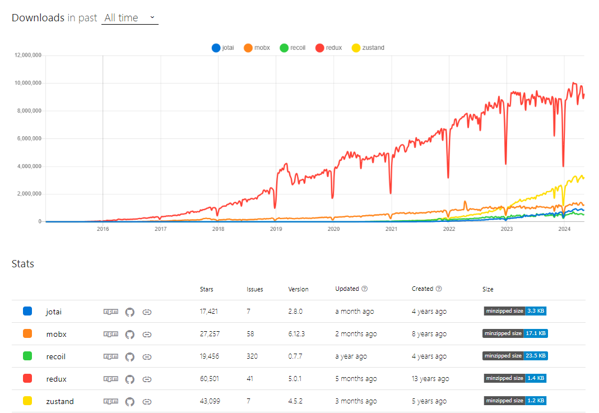

# 전역 상태 관리 기술 스택 중 `Redux` 를 선택한 이유

---

전역 상태 관리 라이브러리는 다양한 것이 존재하는데 그 중 `Redux` 를 선택한 이유는 가장 근본적이게도

**가장많은 사람들이 사용하면서 여전히 많이 찾기 때문** 입니다.


<i><a href = 'https://npmtrends.com/jotai-vs-mobx-vs-recoil-vs-redux-vs-zustand'>jotai vs mobx vs recoil vs redux vs zustand</a></i>

통계적을 보면 `Redux` 는 나온지 가장 오래 되었으면서 여전히 많은 사람들이 찾는 전역 상태 관리 라이브러리입니다.

이는 오랜 기간 동안 많은 사용자들이 쓰면서 축적된 정보들과 커뮤니티 등을 통해 안정성이 보장되어 있고

다른 라이브러리들은 비교적 신생 라이브러리들이기 때문에 안정성이 보장되지 않은 모습을 볼 수 있습니다.

또한 공식문서의 설명들도 매우 친절하게 잘 설명해줍니다. 대부분의 내용들은 공식 문서를 토대로 작성되었으며

공부한 내용을 정리하기 위해 작성되었습니다.

<i><a href = 'https://ko.redux.js.org/'>Redux 한국판 공식 문서</a></i>

# `Props Drilling` 과 `Context` 를 이용하는 전역 상태 관리법

---

`React` 내부에서 여러 컴포넌트에서 `state` 를 공유하여 사용하기 위해선

`state` 를 `props drilling` 형태로 건내주거나 `React.Context` 를 이용하여 컴포넌트에게 건내주는 방식이 가능합니다.

다만 위 방법들을 사용하면 몇 가지 단점이 존재합니다.

### `state Props drilling` 의 예시

---

```jsx
import React from 'react';

// 최하위 자식 컴포넌트
const ChildComponent = ({ count }) => {
  return <div>Count: {count}</div>;
};

// 중간 자식 컴포넌트 1
const MiddleComponent1 = ({ count }) => {
  return <MiddleComponent2 count={count} />;
};

// 중간 자식 컴포넌트 2
const MiddleComponent2 = ({ count }) => {
  return <ChildComponent count={count} />;
};

// 부모 컴포넌트
const ParentComponent = () => {
  const [count, setCount] = React.useState(0);

  return (
    <div>
      <button onClick={() => setCount(count + 1)}>Increase</button>
      <MiddleComponent1 count={count} />
    </div>
  );
};

export default ParentComponent;
```

예를 들어 `ParentComponent` 에서 정의된 `state` 를 가장 내부에 존재하는 `MiddlComponent2` 에서 사용하기 위해선

`ParentComponent -> MiddleComponnt1 -> MiddleComponent2` 형태로 `props` 를 통해 `state` 를 전달해줘야 합니다.
이 때 `MiddleComponent1` 은 단순히 `MiddleComponent2` 에게 `props` 를 건내주기 위해 `state` 를 받아 전달만 해주기에

**`MiddleComponent1` 은 본인에게 영향을 미치지 않는 `props` 를 받아야 합니다.**

이는 컴포넌트의 역할을 코드만을 보고 추론하기 어렵게 만들며 가독성이 현저히 떨어집니다.

### `Context` 의 예시

---

```jsx
import React, { useState, createContext, useContext } from 'react';

// Context 생성
const CountContext = createContext();

// 최하위 자식 컴포넌트
const ChildComponent = () => {
  const count = useContext(CountContext);
  return <div>Count: {count}</div>;
};

// 중간 자식 컴포넌트
const MiddleComponent = () => {
  return <ChildComponent />;
};

// 부모 컴포넌트
const ParentComponent = () => {
  const [count, setCount] = useState(0);

  return (
    <CountContext.Provider value={count}>
      <div>
        <button onClick={() => setCount(count + 1)}>Increase</button>
        <MiddleComponent />
      </div>
    </CountContext.Provider>
  );
};

export default ParentComponent;
```

`Context` 는 상태를 `Context` 내부에서 정의하고

`Context.Provider value = {state}` 를 이용해 `state` 를 `Provider` 의 자식 컴포넌트들이 모두 사용 가능하게 합니다.

이는 `Props drilling` 을 효과적으로 방지 할 수 있는 효과적인 방법입니다.

다만 해당 방법은 완벽한 해법이 되지 않습니다.

그 이유는 `Context` 내부에서 상태가 한 가지가 아닌 `A , B` 가 정의되어 있고 `Context.Provider value = {[A,B]}` 형태로

`state` 를 전달하여 자식 커뫂넌트들이 `{[A,B]}` 상태를 **구독** 한다고 가정해봅시다.

이 때 각기 다른 컴포넌트가 `A` 와 `B` 중 하나의 상태값만 사용하더라도 단일 상태값중 하나라도 변경된다면

구독중인 상태값 배열 `{[A,B]}` 가 변경되기 때문에 상태값 배열을 구독중인 모든 컴포넌트의 리렌더링이 발생합니다.

**이러한 문제를 해결하기 위해선 각 `Context` 가 하나의 상태값만을 저장하고 여러 `Context` 들이 중첩되어 있는 `nesting Context` 형태로 생성해줘야 합니다.**

```jsx
// 부모 컴포넌트
const ParentComponent = () => {
  const [count, setCount] = useState(0);
  const [anotherValue, setAnotherValue] = useState('Value');

  return (
    <CountContext.Provider value={count}>
      <AnotherContext.Provider value={anotherValue}>
        <div>
          <button onClick={() => setCount(count + 1)}>Increase Count</button>
          <button onClick={() => setAnotherValue('New Value')}>
            Change Another Value
          </button>
          <MiddleComponent />
        </div>
      </AnotherContext.Provider>
    </CountContext.Provider>
  );
};

export default ParentComponent;
```

`Context` 는 사용하기 매우 간편하다는 이저이 존재하지만 여러 전역 상태 저장소를 생성해야 한다는 단점이 존재합니다.

전역 상태 저장소가 여러개 존재한다는 것은 `SSOT` 인 `Single Source of Truth` 원칙을 위반하는 것으로

**데이터는 유일하고 신뢰 할 수 있는 출처를 하나만 두어 데이터의 일관성과 무결성을 유지하는 개념** 을 위반합니다.

관리 해야 할 저장소가 늘어나면 늘어날 수록 데이터들의 흐름을 추적하기고 관리하기가 힘들어집니다.

# `Redux` 등장

이에 전역 상태 관리 라이브러리들이 다양하게 개발되었고 `Redux` 도 그 중 하나입니다.

`Redux` 는 신뢰 할 수 있는 하나의 저장소에서 전역 상태들을 저장하고

상태 값들을 순수 함수 형태로 이뤄진 `Reducer` 로 사이드 이펙트릉 방지하고

`Flux` 패턴을 이용하여 상태 변경의 흐름을 추적하고 관리하기 쉽게 만들었습니다.

> `Flux` 패턴에 대한 내용은 해당 게시글을 참조하세요
> <a href = 'https://velog.io/@yonghyeun/Flux-%ED%8C%A8%ED%84%B4%EC%9D%B4-%EB%AD%98%EA%B9%8C'>웹앱의 MVC 패턴의 한계와 리액트의 Flux 패턴</a>

다만 `Redux` 는 `Flux` 패턴과 완벽하게 일치하지는 않습니다. `dispatcher` 가 존재하지 않기 때문입니다.

구조가 완벽하게 일치하지 않을 뿐 필수 개념은 동일하며 , 오히려 `state` 를 직접적으로 변경하지 않는 순수함수로 이뤄져있다는 점에서

업그레이드 된 `Flux` 패턴이라 바라 볼 수 있겟습니다.

> <i>🤔 <a href = 'https://ko.redux.js.org/understanding/history-and-design/prior-art'>Redux 공식 문서 / 기존 기술</a></i>

이제 좀 더 본격적으로 `Redux` 의 기본 개념에 대해 알아봅시다.

# `Redux` 의 역사와 설계

# 동기

싱글 페이지 애플리케이션이 웹 개발의 주축이 되면서 점점 더 관리해야 하는 상태는 복잡해지고

비동기 처리는 더욱 늘어나고 브라우저 렌더링은 더욱 잦게 일어나게 되었습니다.

이렇게 복잡한 로직들을 `React` 하나만으로 관리하는 아키텍쳐는

멘토스와 콜라를 동시에 같이 두어 금방이라도 터질 것 같은 아슬 아슬한 모습처럼 보입니다.

이에 `Redux` 는 상태만을 관리하는 아키텍쳐를 따로 둬 안정성을 가져왔습니다.

# 3가지 원칙

`Redux` 의 기초를 이루는 원칙은 다음과 같습니다.

## 모든 상태는 하나의 저장소 안에서 하나의 객체 트리 구조로 저장되어야 한다.

데이터의 무결성을 유지하기 위해선 데이터는 **모두 동일한 저장소** 에서 관리되어야 합니다.

이에 `Redux` 는 `Store` 라는 저장소 내부에서 모든 객체들을 트리 구조 형태로 관리합니다.

```jsx
/* Store 에서 관리되는 상태들의 예시
여러 상태값들이 프로퍼티와 값 형태인 모습을 볼 수 있다.
*/
{
  visibilityFilter: 'SHOW_ALL',
  todos: [
    {
      text: 'Consider using Redux',
      completed: true,
    },
    {
      text: 'Keep all state in a single tree',
      completed: false
    }
  ]
}
```

관리 해야하는 데이터들을 한 곳에 모아 **응집성** 을 높히고

객체 형태로 관리하여 찾고자 하는 데이터들을 조회하고 조작하기 쉽게 만들었습니다.

## 상태는 읽기 전용이다.

상태가 변경 될 때 상태값을 수정하기 보다 새로운 상태 값을 생성하고 할당하는 방식은

기존 `React` 에서도 사용하는 방법이기도 합니다.

만약 상태값이 수정 가능한 `mutable` 한 값이라면 어느 순간 상태가 예측 불가능하게 수정되었을 때

추적하기가 쉽지 않습니다.

이에 **`Redux` 는 상태를 변경 시키기 위해 일어난 일을 묘사하는 `action` 객체를 이용하여** 상태 변경을 알리고

해당 객체를 `dispatching` 하여 새로운 상태 값을 생성하여 상태로 할당합니다.

## 상태 변경을 일으키는 리듀서는 순수 함수로 정의되어야 한다.

`Redux` 에서는 상태 변경을 일으키는 아키텍쳐가 `dispatcher` 가 아닌 `Reducer` 로 정의되어 있습니다.

하지만 역할은 비슷합니다. `Action` 객체를 받아 `Store` 에서 업데이트 할 새로운 상태 값을 생성해 넘겨줍니다.

```jsx
function visibilityFilter(state = 'SHOW_ALL', action) {
  switch (action.type) {
    case 'SET_VISIBILITY_FILTER':
      return action.filter;
    default:
      return state;
  }
}

function todos(state = [], action) {
  switch (action.type) {
    case 'ADD_TODO':
      return [
        ...state,
        {
          text: action.text,
          completed: false,
        },
      ];
    case 'COMPLETE_TODO':
      return state.map((todo, index) => {
        if (index === action.index) {
          return Object.assign({}, todo, {
            completed: true,
          });
        }
        return todo;
      });
    default:
      return state;
  }
}

import { combineReducers, createStore } from 'redux';
const reducer = combineReducers({ visibilityFilter, todos });
const store = createStore(reducer);
```

위 예시에서는 `visibilityFilter , todos Reducer` 들이 존재합니다.

`Reducer` 들은 `action` 객체를 받아 `Store` 에서 변경 될 새로운 상태 값을 반환합니다.

이 때 `Reducer` 들은 다음과 같은 원칙을 지켜야 합니다.

- 상태 변경을 위해 참조해야 하는 상태 값은 항상 이전의 상태값이여야 한다.
- 상태값은 `immutable` 하게 관리하고 항상 새로운 상태값을 반환해야 한다.

이를 통해 2번째 원칙을 지키도록 합니다.

`Redux` 에선 뚜렷한 `Dispatcher` 객체가 존재하지 않지만 `Store` 객체에서 간접적으로 `dispatcher` 메소드를 호출하여 `action` 객체를 `Reducer` 들에게 전달합니다.

즉 기존 `Flux` 패턴이 `Component -> Action -> Dispatcher -> Store -> Component` 순으로 갔다면

`Redux` 의 패턴은 `Component -> Action -> Store -> Reducer -> Store -> Component` 순으로 갑니다.

데이터의 전달되는 횟수는 늘어났지만 `Dispatcher` 라는 아키텍쳐를 제거하여 더욱 가볍고

`Store -> Reducer -> Store` 로 전달되는 과정 속에서 상태 변경 이전의 값과 이후의 값을 비교하여 추적하는 것을 더욱 쉽게 만듭니다.

# 용어집

해당 용어들은 타입 시그니처와 함께 모아둔 용어집입니다.

### 상태

```tsx
type State = any;
```

`State` 는 넓은 의미에 단어이지만 `Redux` 에선 `Store` 에서 저장되고 `getState()` 메소드를 통해 반환되는 상태 값들을 의미합니다.

`State` 에는 모든 타입의 값이 들어올 수 있지만 일반적으로 `Object , Map` 과 같이 키-값 컬렉션을 이용합니다.

### 액션

```tsx
type Action = Object;
```

`Action` 객체는 상태 변화를 야기하는 일을 표현하는 평버한 객체입니다. `Action` 에 저장된 값을 이용해 `Store` 에 저장된 상태들 중

어떤 값을 변경할지 , 어떻게 변경할지에 대한 내용을 추가합니다.

필수적으로 **`type`** 프로퍼티를 가져 어떤 액션이 일어났는지를 설명해야 합니다. `type` 필드의 값을 통해 `Reducer` 에서 `Action` 에 대한 새로운 상태 값을 생성합니다.

### 리듀서

```tsx
type Reducer<S, A> = (state: S, action: A) => S;
```

`Reducer` 는 `(state , action) => state` 형태로 표현 가능합니다.

리듀서 함수는 `Redux` 에서만 존재하는 개념이 아니라 **누적값을 받아 새로운 누적값을 반환하는 함수** 모두를 일컫습니다.

즉 , 누적된 이전의 상태값들을 이용해 새로운 상태 값을 반환하는 순수 함수를 `Reducer` 라 합니다.

### 디스패치 함수

```tsx
type BaseDispatch = (a: Action) => Action;
type Dispatch = (a: Action | AsyncAction) => any;
```

`Action` 객체를 가장 먼저 받는 것은 `store` 측입니다. `store.dispatcher` 를 호출해 `Action` 객체를 받아 `Reducer` 에게 전달합니다.

이 때 `Reducer` 에게 전달하기 전 디스패치 함수에 다양한 기능을 추가한 **미들웨어** 를 이용하여 `Action` 객체의 흐름을 추적하거나

경우에 따라 비동기 처리가 필요한 `Action` 객체를 받아 비동기 처리 로직을 처리하는 것이 가능합니다.

따로 미들웨어를 사용하지 않는 한 디스패치 함수는 단순히 `Reducer` 에게 `Action` 객체를 전달하기만 합니다.

다만 이러한 디스패치 함수를 필요에 따라 커스터마이징 하여 더욱 발전된 `Store` 를 생성하는 것이 가능합니다.

### 액션 생성자

```tsx
type ActionCreator<A, P extends any[] = any[]> = (
  ...args: P
) => Action | AsyncAction;
```

액션 생성자는 생성 될 액션 객체를 생성하는 로직을 추상화 한 함수입니다.

예를 들어 항상 `type : ADD_NUMBER` 인 액션 객체를 여러 컴포넌트에서 사용한다고 가정했을 때

매번 `type : ADD_NUMBER` 가 존재하는 객체를 일일히 처리하기 보다

`type : ADD_NUMBER` 가 존재하는 액션 객체를 생성하는 액션 생성자 함수를 이용하는 편이

코드의 중복을 피하고 관리하기 편하게 만들 것입니다.

다만 주의해야 할 점은 액션 생성자로 반환된 액션은 `Store` 에게 디스패치 되지 않습니다.

이에 액션 생성자로 생성된 액션을 디스패칭 시키기 위해선 액션 생성자와 `store.dispatcher` 메소드를 호출하는

**바인드 된 액션 생성자** 를 이용해야 합니다.

### 비동기 액션

```tsx
type AsyncAction = any;
```

비동기 액션은 디스패치 함수로 보내지는 값이지만 리듀서에게 받아들여질 준비가 되지 않은 값입니다.

대부분 비동기 처리가 필요한 값들을 의미합니다.

이에 비동기 액션들이 `Reducer` 에서 처리 되기 전 , 미들웨어를 통해 `Reducer` 에서 처리 가능한 액션 객체를 생성해 넘겨주어야 합니다.

컴포넌트 내부에서 비동기 처리를 `pending` 시킨 후 `Action` 객체를 생성하는 방법도 있겠지만

`Redux` 내부에서 처리 할 수 있도록 하여 상태 관리의 책임을 모두 `Redux` 에게 위임함으로서 클린한 아키텍쳐를 유지 할 수 있습니다.

### 미들웨어

```tsx
type MiddlewareAPI = { dispatch: Dispatch; getState: () => State };
type Middleware = (api: MiddlewareAPI) => (next: Dispatch) => Dispatch;
```

미들웨어는 디스패치 함수를 받아 새로운 디스패치 함수를 반환하는 고차 함수입니다.

이는 더욱 고차원으로 발전된 디스패치 함수를 생성하여 비동기 액션을 처리하거나 , 디스패칭 될 때 마다 로그를 찍는 등

다양한 기능이 추가된 디스패치 함수를 사용 할 수 있게 만듭니다.

### 저장소

```tsx
type Store = {
  dispatch: Dispatch;
  getState: () => State;
  subscribe: (listener: () => void) => () => void;
  replaceReducer: (reducer: Reducer) => void;
};
```

저장소는 관리해야 할 상태들을 저장하는 객체이면서 `Action` 객체를 `Reducer` 에게 전달하거나 받습니다.

이를 통해 상태를 저장 및 변경하고

`getState` 메소드를 통해 `store` 를 구독하고 있는 컴포넌트에게 상태를 전달합니다.

`subscribe` 에 리스너 메소드를 등록하여 상태가 바뀔 때 마다 호출될 함수를 등록 할 수 잇습니다.

`replaceReducer` 는 핫 리로딩과 코드 분할을 구현 할 때 사용하는데 저희가 사용 할 일은 별로 없습니다.

### 저장소 생성자

```tsx
type StoreCreator = (reducer: Reducer, preloadedState: ?State) => Store;
```

저장소 생성자는 `store` 를 생성하는 함수로 `Reducer` 들을 받아 저장소를 생성합니다.

이는 기본 저장소 생산자임 `createStore` 메소드를 통해 생성 할 수 잇습니다.
